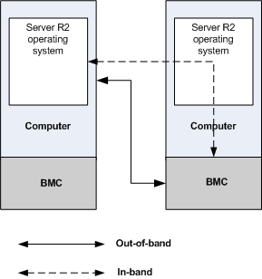

# IPMI Provider

The Microsoft Intelligent Platform Management Interface (IPMI) driver and WMI IPMI provider supply data from Baseboard Management Controller (BMC) operations to the operating system. It also supports an IPMI driver class. The [**\_\_Win32Provider**](https://msdn.microsoft.com/library/aa394688) instance that represents this provider is named "IPMIPrv". The IPMI provider is installed by default.

## Microsoft IPMI Implementation

The IPMI provider is a standard WMI provider that supplies classes, methods, and properties that represent BMC configuration and sensor data. The IPMI provider obtains BMC data through the IPMI driver. For more information about the role of WMI providers, see [WMI Architecture](https://msdn.microsoft.com/library/aa394553).

The IPMI provider and driver enable you to perform the following operations remotely. These operations do not depend on the computer CPU, system BIOS, or the operating system:

-   Inventory

    One server can survey all the computers on a network, even if the operating system is not running or deployed.

-   Monitoring

    BMC sensor data or events from remote computers can be monitored either through the operating system ([*in-band*](https://msdn.microsoft.com/library/aa384465#winrm-gloss-in-band)) or by obtaining data directly from the BMC ([*out-of-band*](https://msdn.microsoft.com/library/aa384465#winrm-gloss-out-of-band)).

-   Logging

    The IPMI provider gives you access to the events recorded in the BMC [*System Event Log*](https://msdn.microsoft.com/library/aa384465#winrm-gloss-system-event-log) (SEL). Each event corresponds to a [**LogRecord**](logrecord.md) instance in the IPMI provider classes. You can view these events through the Event Collector tool, Wecutil.cmd. SEL events appear in the Hardware Events log in the Windows Event log. You can write custom events, such as bug check data and shutdown information, to the SEL.

To request BMC data using the WS-Management protocol, write [Windows Remote Management (WinRM)](https://msdn.microsoft.com/library/aa384426) scripts using [WinRM Scripting API](https://msdn.microsoft.com/library/aa384469).

## IPMI Provider

The Microsoft IPMI provider implements a subset of the standard IPMI CIM Mapping Specification.

The IPMI provider has several WMI classes that enable administrators to access BMC information through the IPMI Driver.

|                                                              |                                                                                                                                                                                                        |
|--------------------------------------------------------------|--------------------------------------------------------------------------------------------------------------------------------------------------------------------------------------------------------|
| [**Account**](account.md)                                   | Represents a user account, which stores authentication and authorization data for the IPMI provider.                                                                                                   |
| [**AdminDomain**](admindomain.md)                           | Represents a grouping of computer system elements, represented by [**ComputerSystem**](computersystem.md) instances.                                                                                  |
| [**AuthorizedPrivilege**](authorizedprivilege.md)           | Represents authorization information for an [**Account**](account.md) instance, which specifies account privileges to activities.                                                                     |
| [**ComputerSystem**](computersystem.md)                     | Represents a computing system in the management domain defined by [**AdminDomain**](admindomain.md).                                                                                                  |
| [**ConcreteCollection**](concretecollection.md)             | Provides a concrete class version of the [**CIM\_Collection**](cim_collection) class.                                                                                                                  |
| [**LogRecord**](logrecord.md)                               | Represents a log entry in the BMC System Event Log (SEL).                                                                                                                                              |
| [**Microsoft\_IPMI**](microsoft-ipmi.md)                    | Contains methods which issue commands to a device that has an implementation of IPMI.                                                                                                                  |
| [**NumericSensor**](numericsensor.md)                       | Represents a numeric type of sensor.                                                                                                                                                                   |
| [**PrivilegeGroup**](privilegegroup.md)                     | Represents a group of [**AuthorizedPrivilege**](authorizedprivilege.md) objects.                                                                                                                      |
| [**RecordLog**](recordlog.md)                               | Represents the BMC System Event Log (SEL).                                                                                                                                                             |
| [**RegisteredProfile**](registeredprofile.md)               | Represents a registered profile, which manages use cases for a system or service.                                                                                                                      |
| [**Sensor**](sensor.md)                                     | Represents a hardware device capable of measuring the characteristics of some physical property, for example, the temperature or voltage of the computer system monitored by the BMC.                  |
| [**SystemSpecificCollection**](systemspecificcollection.md) | Represents the collection of sensors for the BMC. Each [**ComputerSystem**](computersystem.md) that represents a BMC has only one [**SystemSpecificCollection**](https://msdn.microsoft.com/library/aa393885) child. |

 

Because the IPMI provider is a WMI provider, you can obtain BMC data over a normal WMI DCOM connection either locally or remotely. However, when connecting through WMI, you cannot obtain data directly from the BMC hardware. Windows Remote Management enables you to access data directly from a BMC that implements the WS-Management protocol protocol, even if the associated computer operating system is unavailable or is not running on a Windows operating system.

Connections to remote computers through WMI use DCOM, which allocates ports dynamically. The Windows Firewall, if enabled, requires an appropriate configuration at startup to enable WMI DCOM connections. WinRM, which assigns one port, is more firewall-friendly. For more information about WMI remote connections, see [Connecting to WMI on a Remote Computer](https://msdn.microsoft.com/library/aa389290).

For more information about IPMI classes, see Intelligent Platform Management Interface (IPMI) Classes.

## IPMI Driver

The IPMI driver is a WDM kernel mode driver that communicates with the BMC using KCS ([*Keyboard Controller Style*](https://msdn.microsoft.com/library/aa384465#winrm-gloss-keyboard-controller-style)). For more information about driver installation, see [Installation and Configuration for Windows Remote Management](https://msdn.microsoft.com/library/aa384372). It appears in the Device Manager as Microsoft SMBIOS Generic IPMI Compliant Device.

## Related topics

<dl> <dt>

[WMI Classes](https://msdn.microsoft.com/library/aa394554)
</dt> <dt>

[Windows Remote Management (WinRM)](https://msdn.microsoft.com/library/aa384426)
</dt> </dl>

 

 

