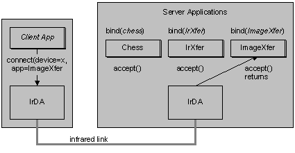

# Application-level Addressing

Application-level addressing is the ability of a client application to request a connection to a particular server application (specifically, to a particular socket or communications endpoint). Multiple server applications can be waiting concurrently for incoming connections without interfering with one another.

IrLMP directly supports the concept of application-level addressing through an 8-bit protocol field called an LSAP-SEL.

Since LSAP-SELs are only 8 bits wide, and because no authority coordinates this space, using a well-known LSAP-SEL to identify an application is not recommended. Windows uses the GetValueByClass IAS service to map an ASCII service name to an LSAP-SEL at connect time, which means a server can register itself with an ASCII name, and a client can connect to this server by using the same name.

Non-Windows devices can connect to a Windows IrDA server by performing an IAS GetValueByClass query on the attribute "IrDA:TinyTP:LsapSel" with the desired service name as the class. The result of this query is an LSAP-SEL, which the device can then use to initiate a TinyTP connection. The correct server will receive the incoming connection. The actual LSAP-SELs used in this scheme may change each time a server is restarted.

Non-Windows devices can support an inbound connection from a Windows system by supporting the same query initiated by the Windows side.

 

 

