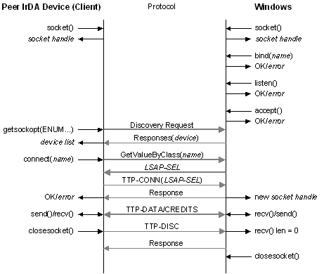

# Data Transfer and Connection Close

Once a connection is established, the Windows Sockets [**send**](https://msdn.microsoft.com/library/windows/desktop/ms740149) and [**recv**](https://msdn.microsoft.com/library/windows/desktop/ms740121) function calls translate into TinyTP send and receive functions. Even though IrLAP is half-duplex, the IrDA application is not aware of that limitation. The **send** and **recv** functions can be called at the same time, on the same connection on two different threads.

The stack manages TinyTP credits on behalf of the application. When the peer stops issuing TinyTP credits, the sender blocks in the [**send**](https://msdn.microsoft.com/library/windows/desktop/ms740149) function call. A non-Windows device must issue TinyTP credits as it is able to consume new data. Windows stops issuing credits when the receiver stops calling the [**recv**](https://msdn.microsoft.com/library/windows/desktop/ms740121) function to consume data.

A Windows Sockets application can send a large buffer of data on a [**send**](https://msdn.microsoft.com/library/windows/desktop/ms740149) function call and the stack will segment it as required. Applications will get substantially higher performance if they pass in at least 8 kB of data on a single **send** function call.

IrDA through Winsock supports **SOCK\_STREAM** data stream semantics, which means any notion of message boundaries is not preserved. Applications commonly add a length field to the head of messages to pass message boundary information to a peer.

When one side of a connection closes with the [**closesocket**](https://msdn.microsoft.com/library/windows/desktop/ms737582) function call, all data previously sent is delivered to the peer. When the peer consumes all data, the next [**recv**](https://msdn.microsoft.com/library/windows/desktop/ms740121) function call it issues returns with a length of zero, indicating a normal socket close. Any error that prevents data from being sent correctly will result in a Windows Sockets error being returned to the application.

 

 

