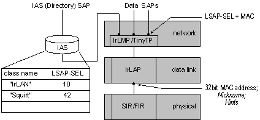

# Directory Services for IrLMP Through IAS

IrLMP includes a directory services protocol, Information Advertising Service (IAS), that runs directly on top of IrLMP. IAS is commonly used to map an ASCII service name to an [*LSAP-SEL*](l-gly.md#-irda-lsap-sel-gly). LSAP-SEL is a protocol element used to select one application from multiple applications that may be running on the server. The service name is a friendly name exposed to applications. Non-Windows devices must be aware of these conventions, which are used by Windows.

IrLMP defines a mode of service called exclusive mode. In this mode, only a single IrLMP connection is supported and the flow control features of IrLAP are used. TinyTP is not used. Exclusive mode is used by the IrLPT protocol that exchanges information with IrLPT printers.

 

 

