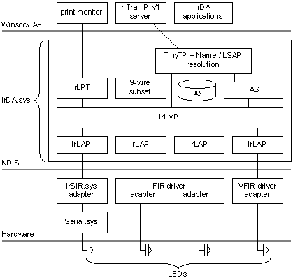

# IrDA Hardware Drivers

[*SIR*](s-gly.md#-irda-sir-gly) [*UART*](u-gly.md#-irda-uart-gly)-based serial adapters are supported by the Windows component IrSIR.sys. IrSIR uses the services of the Windows NT serial driver Serial.sys or a Serial.sys-compatible serial driver to communicate with the IrDA hardware. Built-in SIR hardware should expose itself through the system BIOS with device ID PNP0510 or PNP0511.

[*FIR*](f-gly.md#-irda-fir-gly) IrDA hardware must be exposed as an NDIS 4.0 miniport driver. FIR drivers can expose as many NDIS adapters as the driver can support. Each adapter is a unique IrDA transceiver that can support a unique instance of IrLAP. FIR hardware should have a unique device ID and an associated vendor-supplied driver. FIR hardware that is also compatible with SIR can also expose an alias device ID of PNP0510 or PNP0511 to allow SIR-only operation using IrSIR.

For more details on designing IrDA drivers for Windows please refer to Microsoft Windows Driver Development Kit (DDK).

 

 

