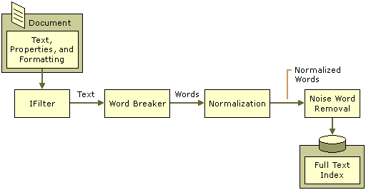
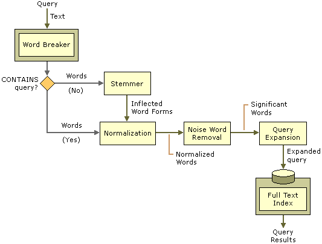

# About Language Resources

> [!Note]  
> Indexing Service is no longer supported as of Windows XP and is unavailable for use as of Windows 8. Instead, use [Windows Search](https://msdn.microsoft.com/library/windows/desktop/aa965362) for client side search and [Microsoft Search Server Express]( http://go.microsoft.com/fwlink/p/?linkid=258445) for server side search.

 

The language resources for Indexing Service consist of word breakers and stemmers that extend index building and querying capabilities to new languages and locales. Word breakers are used during both index creation and querying. Stemmers are used only for querying.

**Figure 1: Language Resources During Index Creation**

**Figure 1** illustrates the role of language resources for Indexing Service during the index creation process. The indexing component uses an IFilter component to access a document in its native format. The IFilter component extracts text content, properties, and formatting from the document. The IFilter identifies the locale of the document that it is filtering. The indexing component invokes the appropriate word breaker for that locale. If none is available, the indexing component invokes the neutral word breaker. The word breaker receives, from an IFilter, an input stream of Unicode characters that the word breaker parses to produce individual words and phrases. The word breaker also normalizes date and time formats. The indexing component in Indexing Service normalizes the words produced by the word breaker by converting the words to uppercase. The indexing component saves the words to the full-text index, with the exception of noise words identified for that locale.

The following table lists the steps and corresponding results for the sentence "**Figure 1** illustrates the role of language resources for Indexing Service during the index creation process."

| Action                  | Resulting text                                                                                                                 |
|-------------------------|--------------------------------------------------------------------------------------------------------------------------------|
| Original text           | **Figure 1** illustrates the role of language resources for Indexing Service during the index creation process.                |
| Filtering               | Figure 1 illustrates the role of language resources for Indexing Service during the index creation process.                    |
| Word breaking           | Figure, 1, illustrates, the, role, of, language, resources, for, Indexing, Service, during, the, index, creation, process, EOS |
| Normalization           | FIGURE, 1, ILLUSTRATES, THE, ROLE, OF, LANGUAGE, RESOURCES, INDEXING, SERVICE, DURING, THE, INDEX, CREATION, PROCESS           |
| Noise word removal      | FIGURE, ILLUSTRATES, ROLE, LANGUAGE, RESOURCES, INDEXING, SERVICE, DURING, INDEX, CREATION, PROCESS                            |
| Save to full-text index | FIGURE, ILLUSTRATES, ROLE, LANGUAGE, RESOURCES, INDEXING, SERVICE, DURING, INDEX, CREATION, PROCESS                            |

 

Indexing Service uses word breakers and stemmers to expand FREETEXT queries during query time. **Figure 2** illustrates the role of language resources for Indexing Service during querying.

**Figure 2: Language Resources During Query Time**

The query component determines the locale of the query that it is running. The locale of the query is the default locale for Indexing Service unless a locale identifier (LCID) is passed as a query parameter. The query component invokes the appropriate word breaker on the query terms listed in the WHERE clause of the query. For example, if the WHERE clause of the query contains "FREETEXT (apples, oranges, and pears)," the word breaker receives the text, "apples, oranges, and pears." If the query WHERE clause uses the CONTAINS full-text predicate, the text output from the word breaker is normalized. Otherwise, the query component passes each word identified by the word breaker to the appropriate stemmer for that language and locale. The stemmer generates a list of alternative, or inflected, forms for that word. The query component normalizes the expanded list of query terms and removes noise words.

The following table lists the steps and corresponding results for the query "apples, oranges, and pears."

| Action                       | Resulting text                                            |
|------------------------------|-----------------------------------------------------------|
| Original text                | apples, oranges, and pears                                |
| Word breaking                | apples, oranges, and, pears, EOS                          |
| Stemming                     | apple, apples, orange, orangey, oranges, and, pear, pears |
| Normalization                | APPLE, APPLES, ORANGE, ORANGEY, ORANGES, AND, PEAR, PEARS |
| Noise word removal           | APPLE, APPLES, ORANGE, ORANGEY, ORANGES, PEAR, PEARS      |
| Expanded list of query terms | APPLE, APPLES, ORANGE, ORANGEY, ORANGES, PEAR, PEARS      |

 

The expanded query terms increase the likelihood that the query will find documents that match the intent of the original query. Text that the word breaker or stemmer generates at query time is not stored on disk.

This section contains the following topics:

-   [Word Breaking](word-breaking.md)
-   [Stemming](stemming.md)
-   [Normalization](normalization.md)
-   [Noise Words](noise-words.md)

## Related topics

<dl> <dt>

[Support for Multiple Languages](support-for-multiple-languages.md)
</dt> <dt>

[Valid Locale Identifiers](valid-locale-identifiers.md)
</dt> </dl>

 

 

