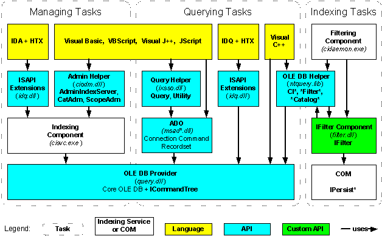

# Combinations of Tasks, Languages, and APIs

\[Indexing Service is no longer supported as of Windows XP and is unavailable for use as of Windows 8. Instead, use [Windows Search](https://msdn.microsoft.com/library/windows/desktop/aa965362) for client side search and [Microsoft Search Server Express]( http://go.microsoft.com/fwlink/p/?linkid=258445) for server side search.\]

Many combinations of languages, APIs, and tools are available for programming Indexing Service to achieve your desired tasks. The combination you choose depends on many factors, including your orientation (file system or web server), programming background (application developer or script writer and language), desired performance, and task category.

The following diagram shows possible combinations of tasks, languages, and APIs and indicates their relationships with Indexing Service and COM components. The diagram does not include tools, because it is sometimes possible to use several tools for some of the combinations shown. For a description of the tools, see [Programming Tools](programming-tools.md).

The dotted lines divide the diagram into three regions that represent the task categories of managing, querying, and indexing. Each box in the diagram denotes a language, API, or component. The color (or shading) key for the boxes is the following.

-   White (unshaded) boxes represent components of Indexing Service or COM. For a description of the Indexing Service components, see [Components of Indexing Service](components-of-indexing-service.md).
-   Yellow (lightly shaded) boxes represent languages. For a description of the programming languages, see [Programming Languages](programming-languages.md).
-   Blue (intermediately shaded) boxes represent APIs. For a description of the APIs, see [Programming APIs](programming-apis.md).
-   Green (darkly shaded) boxes represent an API that is customized using one of the languages — most likely Visual C++.

The arrows in the diagram indicate calling or usage relationships between the languages, APIs, and components.

## Related topics

<dl> <dt>

[Secure Code Practices](secure-code-practices.md)
</dt> </dl>

 

 

