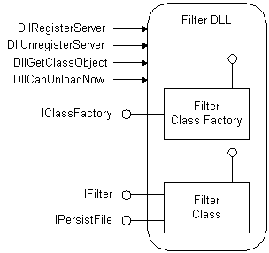

# Describing the Filter Structure

> [!Note]  
> Indexing Service is no longer supported as of Windows XP and is unavailable for use as of Windows 8. Instead, use [Windows Search](https://msdn.microsoft.com/library/windows/desktop/aa965362) for client side search and [Microsoft Search Server Express]( http://go.microsoft.com/fwlink/p/?linkid=258445) for server side search.

 

Each filter is a dynamic-link library (DLL) file that implements an in-process COM server to supply the specified filtering capabilities. The following figure shows the overall structure of a typical filter DLL. (A more complex example could implement more than one filter class.)

 

 

