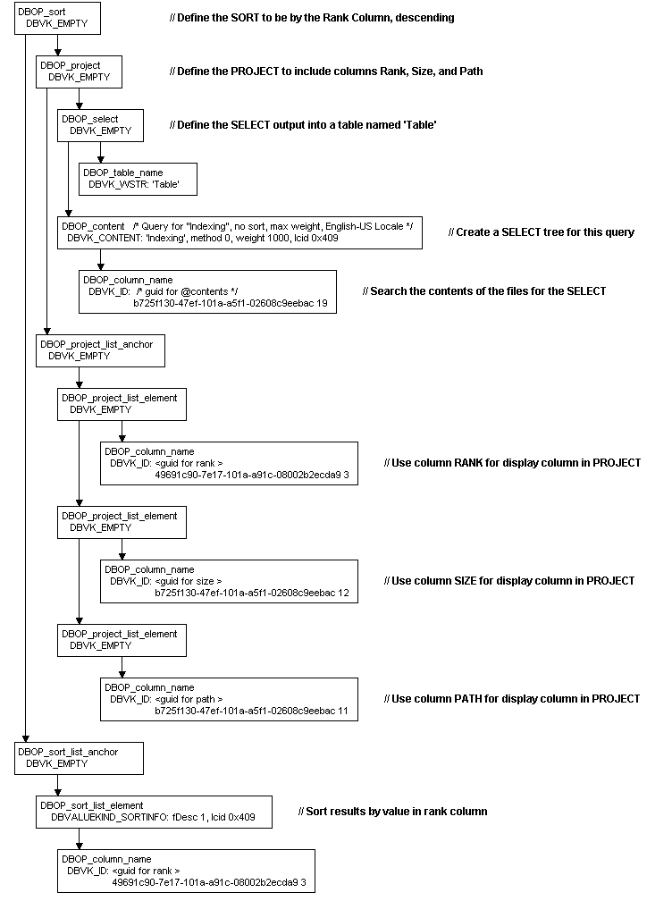

# Example of Command Tree

> [!Note]  
> Indexing Service is no longer supported as of Windows XP and is unavailable for use as of Windows 8. Instead, use [Windows Search](https://msdn.microsoft.com/library/windows/desktop/aa965362) for client side search and [Microsoft Search Server Express]( http://go.microsoft.com/fwlink/p/?linkid=258445) for server side search.

 

Understanding the output from the [Simple sample](simple-sample.md) (QSample) in the samples directory of the Platform SDK helps to explain how Indexing Service resolves a query through its OLE DB interfaces.

For example, the following query, which is the default query run against the "SYSTEM" catalog, uses the system default locale LCID (0x409 = 1033 = "US-EN"=United States' English) and returns columns "Size" and "Path" with no sorting and no custom properties. The output of the sample is the following.

``` syntax
op: (15) DBOP_sort
wKind: (0) DBVALUEKIND_EMPTY 
first child:
  op: (52) DBOP_project
  wKind: (0) DBVALUEKIND_EMPTY 
  first child:
    op: (50) DBOP_select
    wKind: (0) DBVALUEKIND_EMPTY 
    first child:
      op: (10) DBOP_table_name
      wKind: (130) DBVALUEKIND_WSTR: 'Table'
      next sibling:
        op: (144) DBOP_content
        wKind: (259) DBVALUEKIND_CONTENT: 'Indexing', method 0, weight 1000, lcid 0x409
        first child:
          op: (5) DBOP_column_name
          wKind: (258) DBVALUEKIND_ID: b725f130-47ef-101a-a5f1-02608c9eebac 19
    next sibling:
      op: (183) DBOP_project_list_anchor
      wKind: (0) DBVALUEKIND_EMPTY 
      first child:
        op: (184) DBOP_project_list_element
        wKind: (0) DBVALUEKIND_EMPTY 
        first child:
          op: (5) DBOP_column_name
          wKind: (258) DBVALUEKIND_ID: 49691c90-7e17-101a-a91c-08002b2ecda9 3
        next sibling:
          op: (184) DBOP_project_list_element
          wKind: (0) DBVALUEKIND_EMPTY 
          first child:
            op: (5) DBOP_column_name
            wKind: (258) DBVALUEKIND_ID: b725f130-47ef-101a-a5f1-02608c9eebac 12
          next sibling:
            op: (184) DBOP_project_list_element
            wKind: (0) DBVALUEKIND_EMPTY 
            first child:
              op: (5) DBOP_column_name
              wKind: (258) DBVALUEKIND_ID: b725f130-47ef-101a-a5f1-02608c9eebac 11
  next sibling:
    op: (191) DBOP_sort_list_anchor
    wKind: (0) DBVALUEKIND_EMPTY 
    first child:
      op: (192) DBOP_sort_list_element
      wKind: (265) DBVALUEKIND_SORTINFO: fDesc 1, lcid 0x409
      first child:
        op: (5) DBOP_column_name
        wKind: (258) DBVALUEKIND_ID: 49691c90-7e17-101a-a91c-08002b2ecda9 3
```

The following figure depicts the output as a tree for easier understanding.



 

 


