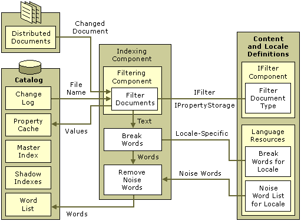

# Filtering, Word Breaking, and Removing Noise Words

\[Indexing Service is no longer supported as of Windows XP and is unavailable for use as of Windows 8. Instead, use [Windows Search](https://msdn.microsoft.com/library/windows/desktop/aa965362) for client side search and [Microsoft Search Server Express]( http://go.microsoft.com/fwlink/p/?linkid=258445) for server side search.\]

The Indexing component of Indexing Service creates a [Filtering component](filtering-component.md) for each of its catalogs. The Filtering component takes documents that appear in its change log and filters them for text-type and value-type properties using the appropriate [**IFilter component**](ifilter-component.md). The Filtering component places internal value-type properties into the property cache and passes the text-type properties to the word breaker for the appropriate locale. The word breaker produces words and passes them to the noise-word removal process, which uses the noise-word list for the appropriate locale. Finally, the resulting words are placed into word lists along with the containing document name, word location, and locale.

The following diagram shows the document filtering part of the indexing process in detail.

In the diagram, rectangles represent sources and sinks of Indexing Service data, and the ellipses represent Indexing Service processes. The solid lines indicate the flow of data in the direction of the arrows. Dotted lines between processes indicate where components can be substituted. A rounded, dotted rectangle delineates Indexing Service components — in this case, the [Indexing](indexing-component.md), [Filtering](filtering-component.md), [**IFilter**](ifilter-component.md) components, and components for [Language Resources](language-resources.md). The diagram shows how the customizable **IFilter** and [language resources](about-language-resources.md) affect the transformation of documents and their properties into word lists for the Indexing Service catalog.

 

 

