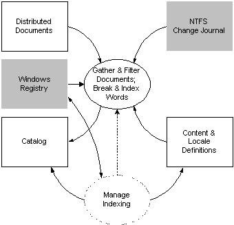

# Indexing and Managing

\[Indexing Service is no longer supported as of Windows XP and is unavailable for use as of Windows 8. Instead, use [Windows Search](https://msdn.microsoft.com/library/windows/desktop/aa965362) for client side search and [Microsoft Search Server Express]( http://go.microsoft.com/fwlink/p/?linkid=258445) for server side search.\]

Indexing is triggered by changes to documents in the set of distributed documents indexed by a catalog. Indexing proceeds based on several entries in the Windows registry. You can manage indexing by adjusting the registry entries, manipulating the catalogs, providing custom filters and locale-specific word breakers and noise-word lists, and directly controlling the state of the [Indexing component](indexing-component.md).

The following diagram illustrates how the task of managing Indexing Service integrates with the indexing process.

In the diagram, rectangles represent sources and sinks of Indexing Service data, and the ellipse represents a group of Indexing Service processes. A shaded rectangle denotes a Windows data source or sink used by Indexing Service. The solid lines indicate the flow of data in the direction of the arrows. A dotted line indicates a control functionality between processes.

An end-user of Indexing Service usually manages indexing using the MMC. An application or script can programmatically manage indexing using the methods and properties of the Indexing Service [Admin Helper](programming-apis.md#-idxs-admin-helper-api) automation objects ([AdminIndexServer](iadminindexserver.md), [CatAdm](icatadm.md), and [ScopeAdm](iscopeadm.md)). These programming elements provide read/write access to Indexing Service [Registry entries](registry-entries.md), provide properties and methods for manipulating catalogs and scopes, and provide methods for changing the state of Indexing Service. Also, the [ISAPI extensions](programming-apis.md#-idxs-isapi-extensions-api) for Indexing Service provide programmatic control of Indexing Service using Internet Data Administration files.

 

 

