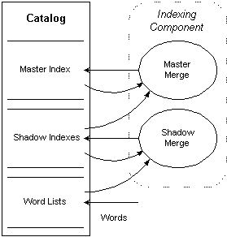

# Merging Indexes

> [!Note]  
> Indexing Service is no longer supported as of Windows XP and is unavailable for use as of Windows 8. Instead, use [Windows Search](https://msdn.microsoft.com/library/windows/desktop/aa965362) for client side search and [Microsoft Search Server Express]( http://go.microsoft.com/fwlink/p/?linkid=258445) for server side search.

 

The word lists in an Indexing Service catalog are temporary, memory-resident, lightly compressed, and quick to create (and recreate). Registry settings determine the maximum size of each word list and the maximum number of word lists for a catalog, because having a large amount of the catalog in the form of word lists uses a large amount of memory.

When the number of word lists exceeds the maximum allowable number, the [Indexing component](indexing-component.md) performs a shadow merge, which transforms word lists into shadow indexes, to reduce memory usage. Shadow indexes are persistent, disk-resident, and highly compressed. A special case of a shadow merge, the annealing merge, includes both existing shadow indexes and word lists in the merge process into shadow indexes. This reduces the number of shadow indexes and increases the efficiency of querying without having to perform a master merge.

Once a day, as determined by a registry setting, the Indexing component performs a master merge, which combines shadow indexes with the master index. The master index is persistent, disk-resident, highly compressed, and optimized for querying.

The following diagram shows the merging part of the indexing process in detail.

In the diagram, rectangles represent sources and sinks of Indexing Service data, and the ellipses represent Indexing Service processes. The solid lines indicate the flow of data in the direction of the arrows. A rounded, dotted rectangle delineates an Indexing Service component — in this case, the [Indexing component](indexing-component.md). The diagram shows the progression of indexes from word lists to shadow indexes to the master index in the Indexing Service catalog. A special case of the shadow merge is an annealing merge. It includes both existing shadow indexes and word lists in a merge process into shadow indexes. This reduces the number of shadow indexes and increases the efficiency of querying without having to perform a master merge.

An end user of Indexing Service can manually start a master merge using the MMC.

 

 

