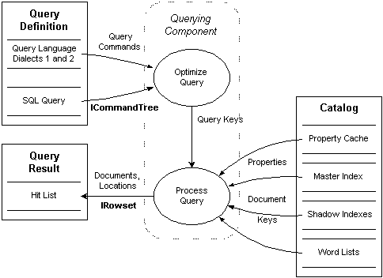

# Optimizing and Processing Queries

\[Indexing Service is no longer supported as of Windows XP and is unavailable for use as of Windows 8. Instead, use [Windows Search](https://msdn.microsoft.com/library/windows/desktop/aa965362) for client side search and [Microsoft Search Server Express]( http://go.microsoft.com/fwlink/p/?linkid=258445) for server side search.\]

An end user, application, or script submits a query to Indexing Service using one of the [Query Languages for Indexing Service](query-languages-for-indexing-service.md). The [Querying component](querying-component.md) first optimizes the query for fastest performance or for greatest hit recall, and then returns the resulting documents and locations for matches from the Indexing Service catalog.

The following diagram shows the querying process in detail.

In the diagram, rectangles represent sources and sinks of Indexing Service data, and an ellipse represents an Indexing Service process. The solid lines indicate the flow of data in the direction of the arrows. A rounded, dotted rectangle delineates an Indexing Service component — in this case, the [Querying component](querying-component.md), which optimizes and processes queries.

An end-user of Indexing Service can query Indexing Service using the **Start**, **Search for Files**, or **Folder** dialog box. An application or script can programmatically query Indexing Service using the methods and properties of the Indexing Service [Query Helper](https://www.bing.com/search?q=Query Helper) automation objects ([Query](iixssoquery.md) and [Utility](iixssoutil.md)) or the [ActiveX Data Objects](https://www.bing.com/search?q=ActiveX Data Objects) (ADO). These programming elements provide properties and methods for selecting catalogs and scopes, provide methods and properties for setting query parameters and query content, and provide methods for executing queries and retrieving the results. Also, the [ISAPI extensions](https://www.bing.com/search?q=ISAPI extensions) for Indexing Service provide programmatic querying of Indexing Service using Internet Data Query (.idq) files. Finally, an application can use the [OLE DB Helper](https://www.bing.com/search?q=OLE DB Helper) functions or the [OLE DB Provider for Indexing Service](ole-db-provider-for-indexing-service.md) interfaces to execute queries.

 

 

