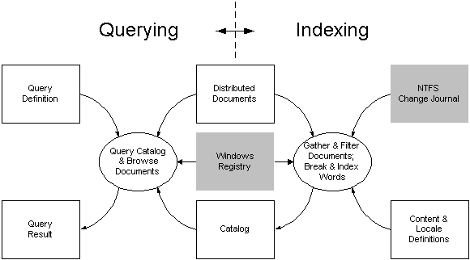

# Processing in Indexing Service

> [!Note]  
> Indexing Service is no longer supported as of Windows XP and is unavailable for use as of Windows 8. Instead, use [Windows Search](https://msdn.microsoft.com/library/windows/desktop/aa965362) for client side search and [Microsoft Search Server Express]( http://go.microsoft.com/fwlink/p/?linkid=258445) for server side search.

 

When Indexing Service is fully active, a user or application can perform several types of tasks, including managing tasks, querying tasks, and indexing tasks. In particular, it is important to note that querying and indexing proceed concurrently using a common set of distributed documents and common catalogs.

The following diagram summarizes the flow of data among the concurrent querying and indexing tasks. (The diagram does not show possible managing tasks.)

In the diagram, rectangles represent sources and sinks of Indexing Service data, and ellipses represent Indexing Service processes or groups of processes. A shaded rectangle denotes a Windows data source or sink used by Indexing Service. The solid lines indicate the flow of data in the direction of the arrows. The following topics describe the querying and indexing processes in greater detail.

-   [Querying a Catalog of Indexed Documents](querying-a-catalog-of-indexed-documents.md)
-   [Indexing a Set of Distributed Documents](indexing-a-set-of-distributed-documents.md)

 

 

