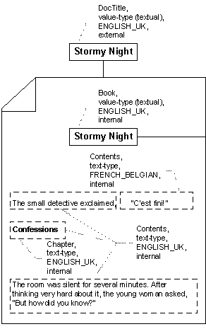

# Property Filtering

> [!Note]  
> Indexing Service is no longer supported as of Windows XP and is unavailable for use as of Windows 8. Instead, use [Windows Search](https://msdn.microsoft.com/library/windows/desktop/aa965362) for client side search and [Microsoft Search Server Express]( http://go.microsoft.com/fwlink/p/?linkid=258445) for server side search.

 

Properties are extracted from documents by filters implemented for specific document types. Some value-type properties are obtained by other means; for example, by the property-storage interfaces. The implementer of a custom [**IFilter**](/windows/win32/Filter/nn-filter-ifilter?branch=master) interface can interpret the contents of a document type in any number of ways, and the descriptions here represent "best practices" for an implementation.

The [**IFilter**](/windows/win32/Filter/nn-filter-ifilter?branch=master) interface contains several methods that Indexing Service uses when filtering a document. The methods include:

-   [**IFilter::Init**](/windows/win32/Filter/nf-filter-ifilter-init?branch=master), which returns the [**IFILTER\_FLAGS**](/windows/win32/Filter/ne-filter-tagifilter_flags?branch=master) enumeration. If the IFILTER\_FLAGS\_OLE\_PROPERTIES member of this enumeration is set to one, Indexing Service uses the [**IPropertySetStorage**](_stg_ipropertysetstorage) and [**IPropertyStorage**](_stg_ipropertystorage) interfaces to enumerate and access external value-type properties.
-   [**IFilter::GetChunk**](/windows/win32/Filter/nf-filter-ifilter-getchunk?branch=master), which returns information from a document in "chunks" with chunk type (text or value), name, and locale. A chunk contains one document property.
-   [**IFilter::GetText**](/windows/win32/Filter/nf-filter-ifilter-gettext?branch=master), which gets a text-type property from a chunk.
-   [**IFilter::GetValue**](/windows/win32/Filter/nf-filter-ifilter-getvalue?branch=master), which gets a value-type property from a chunk.

The following figure graphically represents an example document. The external value-type property DocTitle (obtained using methods of the [**IPropertySetStorage**](_stg_ipropertysetstorage) and [**IPropertyStorage**](_stg_ipropertystorage) interfaces) and the internal value-type property Book (obtained as a result of a custom [**IFilter**](/windows/win32/Filter/nn-filter-ifilter?branch=master) implementation) describe the document as a whole. The text-type properties Contents and Chapter describe the content of the document. When processing this document, the **IFilter** implementation identifies and extracts these properties.

 

 

