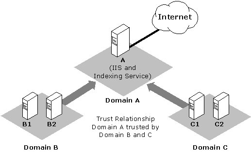

# Supporting Multiple Security Domains

> [!Note]  
> Indexing Service is no longer supported as of Windows XP and is unavailable for use as of Windows 8. Instead, use [Windows Search](https://msdn.microsoft.com/windows/desktop/6da601c6-3742-40ad-99f2-8817f7f642b3) for client side search and [Microsoft Search Server Express]( http://go.microsoft.com/fwlink/p/?linkid=258445) for server side search.

 

Multiple security domains are supported. This section describes how to set up Indexing Service to crawl computers in different system domains for inclusion in an index. The following diagram shows a site with three domains.

In this site, IIS and Indexing Service are running on Server A, which is in Domain A. Server A is connected to the Web. Domain A must be trusted by Domain B and Domain C.

For this example, assume you want to set up virtual roots on Server A for the following Uniform Naming Convention (UNC) paths:

-   \\\\B1\\Share1
-   \\\\B2\\Share2
-   \\\\C1\\Share1
-   \\\\C2\\Share2

Assume a single user ID, Domain\\WebUser, has permission to connect to the four shares.

**To configure Indexing Service for these assumptions**

1.  On Domain A, create the WebUser account. Open **User Manager for Domains**, and add WebUser as a new user on the domain controller for Domain A.
2.  Add DomainA\\WebUser to the list of accounts having interactive logon privileges on Server A. **User Manager for Domains** can check to see whether a user has **Interactive logon privileges**.
3.  Stop the Content Index Service, which also stops Indexing Service.
4.  Restart the Content Index Service, which also starts Indexing Service and starts indexing the documents on all the virtual roots.
5.  Start Internet Service Manager, and add the virtual roots to the UNC shares listed under the first assumption in the previous section. In the **User Name** text box, you must specify the full user ID in the form *domain\\user-id* (DomainA\\WebUser, in the example). The backslash is important.
6.  Repeat step 3 for all the UNC shares you want to add.

If you have had problems with remote virtual roots before starting this procedure, you should delete the contents of your Catalog.wci directory after step 3. Removing the contents of this directory starts Indexing Service with a clean set of data.

> [!Note]  
> This procedure can also configure multiple accounts.

 

## Related topics

<dl> <dt>

[Best Practices](best-practices.md)
</dt> </dl>

 

 

