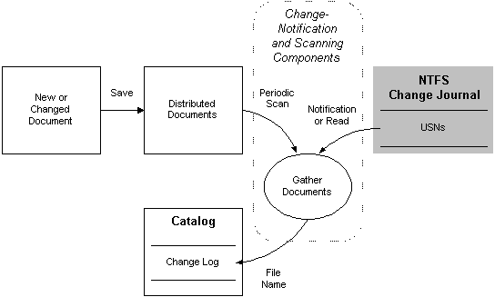

# Updating a Catalog

> [!Note]  
> Indexing Service is no longer supported as of Windows XP and is unavailable for use as of Windows 8. Instead, use [Windows Search](https://msdn.microsoft.com/windows/desktop/6da601c6-3742-40ad-99f2-8817f7f642b3) for client side search and [Microsoft Search Server Express]( http://go.microsoft.com/fwlink/p/?linkid=258445) for server side search.

 

Indexing Service scans the directories and files in the scope of a catalog to produce an initial catalog. After an initial scan, either a change notification on NTFS file system volumes or a periodic scan produces a list of objects to scan in the change log of the catalog. The following diagram shows the catalog updating part of the indexing process in detail.

In the diagram, rectangles represent sources and sinks of Indexing Service data, and the ellipse represents a group of Indexing Service processes. The shaded rectangle denotes a Windows data source used by Indexing Service. The solid lines indicate the flow of data in the direction of the arrows. A rounded, dotted rectangle delineates Indexing Service components — in this case, the [Change Notification](change-notification-component.md) and [Scanning](scanning-component.md) components, which gather changed documents and construct a change log of documents to re-index.

An end-user of Indexing Service can manually start scans using the MMC. An application or script can programmatically start a scan using the methods and properties of the Indexing Service [ScopeAdm](iscopeadm.md) automation object. It is generally unnecessary to manually scan unless a filter, word breaker, or noise-word list has changed.

 

 

