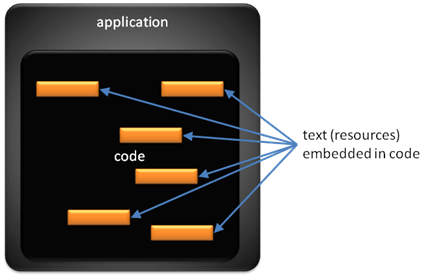
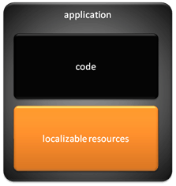
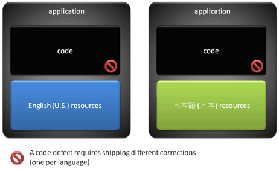
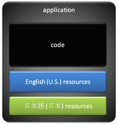
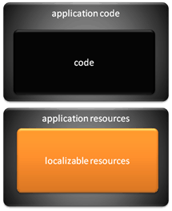

# MUI Fundamental Concepts Explained

-   [Prerequisite for MUI](#prerequisite-for-mui)
-   [Separation of source code from language specific resources](#separation-of-source-code-from-language-specific-resources)
    -   [The early days: code and resources live together](#the-early-days-code-and-resources-live-together)
    -   [Logically separating code and localizable resources](#logically-separating-code-and-localizable-resources)
    -   [Physically separating code and resources](#physically-separating-code-and-resources)
-   [Dynamically loading language-specific resources](#dynamically-loading-language-specific-resources)
-   [Building MUI applications](#building-mui-applications)

## Prerequisite for MUI

The basic prerequisite for building a MUI-compliant application for Windows Vista and beyond is to design the application in accordance with Windows [globalization guidelines](https://msdn.microsoft.com/goglobal/bb688110.aspx).

## Separation of source code from language specific resources

One of the fundamental premises of MUI technology is the separation of application source code from language-specific resources, to enable multi-lingual scenarios in applications more efficiently. The separation of code and resources has been achieved via different mechanisms and to different degrees over time, as outlined in the following sections. Each method provided varying degrees of flexibility in building, deploying, and servicing the application.

The recommended solution for MUI-compliant applications is the last method outlined here, namely the physical separation of application source code and resources, with the resources themselves further broken down into one file per supported language for maximum flexibility in building, deploying, and servicing.

### The early days: code and resources live together

Initially, localized applications were created by editing the source code and changing the resources (usually strings) in the code itself and recompiling the applications. This meant that to produce a localized version, one had to copy the original source code, translate the text (resources) elements within the source code, and recompile the code. The following image shows application code with text that needs to be localized.

While this approach enables the creation of localized applications, it also has significant drawbacks:

-   It requires multiple versions of the source code, at least one for the source language and one for each of the target languages. This creates significant issues synchronizing the different language releases of the application. In particular, when a defect needs to be fixed in the code, the defect needs to be fixed in every copy of the source code (one per language).
-   It is also extremely error-prone as it required localizers—who are not developers—to make modifications in source code, thus creating a considerable risk in terms of code integrity.

The combination of these drawbacks makes this an extremely inefficient proposition, and a better model was needed.

### Logically separating code and localizable resources

A significant improvement over the preceding model is the logical separation of code and localizable resources for an application. This isolates the code from the resources and ensures that code remains untouched when resources are being changed by localization. From an implementation standpoint, strings and other user interface elements are stored in resource files, which are relatively easy to translate and are logically separated from the code sections.

Ideally, adding support for any given language can be as simple as translating the localizable resources into this new language and using these translated resources to create a new localized version of the application—without requiring any code modification. The following image illustrates how code and localizable resources should be logically separated within an application.

This model enables an easier creation of localized versions of an application and is a significant improvement over the previous model. This model, implemented through the use of resource management tools, has been very successful over the years and is still commonly used by many applications today. However, it does have significant drawbacks:

-   While logically separated, code and localized resources are still physically joined in one executable file. In particular, serviceability is still problematic as the same code defect (identical in all language versions) requires a patch per language. Therefore, if one is shipping the application in 20 languages, a service patch needs to be issued 20 times (one for each language), even though the code is only fixed once.
-   Distribution and use of multi-lingual applications are not adequately supported by this model. This can be a significant problem in OEM and enterprise scenarios. For instance, if a computer is to be shared between two users using different languages, applications will need to be installed twice with this model, and then some mechanism will need to be enabled to alternate between the two installations. This assumes that there are no additional dependencies that prevent even this scenario from being implemented. The following image shows an example of a single code defect that requires two patches.

It is clear that while this model works well in some scenarios, its limitations for multi-lingual applications and their deployments can be very problematic.

A variation of this model that alleviates some of the multi-lingual applications issues is the model where the localizable resources contain a set of different language resources. This model has a common code base and several resources for different languages in the same application. For example, an application can ship with English, German, French, Spanish, Dutch, and Italian in the same package. The following image shows an application that contains multiple language resources.

This model makes it easier to service the application when a code defect needs to be fixed—which is an improvement—but does not improve over previous models when it comes to supporting additional languages. In this case, one still needs to release a new version of the application (and that release is potentially complicated by the need to ensure that all language resources are synchronized within the same distribution).

### Physically separating code and resources

The next evolutionary step is to physically separate code and resources. In this model, the resources are abstracted from the code and physically separated in different implementation files. In particular, this means that the code can become truly language independent; the same physical code is actually shipped for all localized versions of an application. The following image illustrates that code and localizable resources must be physically separated.

This approach has several advantages over the previous approaches:

-   Deployment of multi-lingual solutions is greatly simplified. Adding support for any given language requires only shipping and installing a new set of language resources for this particular language. This is particularly important when language resources are not all simultaneously available. With this model, one can deploy an application in a set of core languages and increase the number of supported languages over time without having to modify or redeploy the actual code. This advantage is further extended by a fallback mechanism that allows for partial localization of applications and system components in a given language by ensuring that resources that are not found in this preferred language "fall back" to another language that the users also understand. Overall, this model helps alleviate the considerable burden that global companies face in deploying applications in multiple languages as it enables single image deployment in a much more effective way.
-   Serviceability is improved. A code defect only needs to be fixed and deployed once, as the code is completely localization-independent. With this model, issuing a correction for a code defect, provided the change is not UI-related, is much simpler and cost effective than in any of the previous models.

## Dynamically loading language-specific resources

The MUI fundamental concepts of [physically separating source code from language-specific resources](#physically-separating-code-and-resources), and building a language-neutral core binary for an application, essentially set up an architecture that is conducive to implementing the dynamic loading of language-specific resources based on user and system language settings.

Application source code bundled into the language-neutral core binary can utilize MUI APIs in the Windows platform to abstract the selection of the appropriate display user interface language for a given context. MUI supports this by:

-   Constructing a prioritized list of display user interface languages based on system, user, and application-level, user-level, and system-level settings.
-   Implementing a fallback mechanism that chooses an appropriate candidate from this prioritized list of languages, based on the availability of localized resources.

The benefits of dynamically loading user-interface resources with prioritized fallback are:

-   It allows for partial localization of applications and system components in a given language, as resources that are not found in this preferred language will automatically fall back to the next language on the prioritized list.
-   It enables scenarios such as switching dynamically from one language to another.
-   It allows creating regional or worldwide single deployment images that cover a set of languages for OEMs and enterprises.

## Building MUI applications

The previous sections outlined the options for separating source code from language-specific resources, and the resultant benefit in being able to utilize core Windows platform APIs to dynamically load localized resources. While these are guidelines, it should also be pointed out that there is no specific prescriptive way to develop a MUI application for the Windows platform.

Application developers have full choice in how they handle various user-interface language settings, resource creation options, and resource loading methods. Developers can evaluate the guidelines provided in this document and choose a combination that fits their requirements and development environment.

The following table summarizes the different design options available to application developers who are looking to create a MUI application for the Windows platform.

<table>
<thead>
<tr class="header">
<th>User interface language settings</th>
<th>Resource creation</th>
<th>Resource loading</th>
</tr>
</thead>
<tbody>
<tr class="odd">
<td rowspan="2">Follow UI language settings in the operating system${REMOVE}$ 
</td>
<td>Single language in a split resource binary (MUI Resource Technology)  -or-  Multiple languages in a non-split resource binary </td>
<td>Application calls standard resource loading functions. Resources are returned in the languages matching the operating system settings. </td>
</tr>
<tr class="even">
<td>Application-specific resource mechanism </td>
<td>Application calls MUI API to retrieve the thread-preferred UI languages or process-preferred UI languages from the operating system and use these settings to load its own resources. </td>

</tr>
<tr class="odd">
<td rowspan="2">Application-specific UI language settings${REMOVE}$ 
</td>
<td>Single language in a split resource binary  -or-  Multiple languages in a non-split resource binary </td>
<td>Application calls MUI API to set application-specific UI languages or process-preferred UI languages and then calls standard resource loading functions. Resources are returned in the languages set by the application or system languages.  -or-  Application probes resources in a specific language and handles its own resource extraction from the retrieved binary data. </td>
</tr>
<tr class="even">
<td>Application-specific resource mechanism </td>
<td>Application manages its own resource loading. </td>

</tr>
</tbody>
</table>

 

 

 

