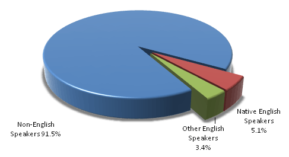

# Overview of MUI

This topic provides a conceptual overview of the Multilingual User Interface (MUI) technology, the platform support it provides for enabling multilingual user experiences, and the benefits it offers to the Windows ecosystem.

On this page:

-   [The need for multilingual computing](#the-need-for-multilingual-computing)
-   [The role of MUI in enabling multilingual computing](#the-role-of-mui-in-enabling-multilingual-computing)
-   [Core concepts of MUI](#core-concepts-of-mui)
-   [History of MUI in Windows](#history-of-mui-in-windows)
-   [Benefits of MUI technology](#benefits-of-mui-technology)

## The need for multilingual computing

To benefit from the growth opportunities presented by international markets, Microsoft's platforms and applications support more languages, cultures and markets than ever before.

Language, culture, and market specifics are still extremely relevant to international users, despite increasing globalization trends. The following pie chart shows that non-English speakers still make up 91.5 percent of the world's population.

Worldwide, there are 193 countries and over 6,900 known living languages in use today. English, despite its role as the world's business language, is only spoken by 8.5% of the world's population as a first or second language. To provide native information to 94% of the world's population, this information would need to be available in the 347 (about 5%) of the world's languages that have at least a million speakers. This is especially true as globalization trends have increased the expectations of these users regarding technology and its availability in their markets.

The need to localize software in more languages has increased over the years and Microsoft is now providing Windows Vista and other products in more languages than ever. This evolution is especially clear with Microsoft Windows, as it has gone from supporting 30 languages with Windows 98 to almost 100 with Windows Vista, as illustrated in the following bar chart.

*Figure 2—Number of languages supported by Microsoft Windows releases*

## The role of MUI in enabling multilingual computing

As discussed in the previous section, [globalization](glossary-for-understanding-mui.md) and [localization](glossary-for-understanding-mui.md) of applications have become a necessity in a more globally integrated world. In particular, as more and more enterprises are going global, either internally or through their business networks, the need for multi-lingual applications is increasing dramatically. So are the hurdles that these companies currently face in deploying these applications globally.

Providing support for more languages for Windows operating systems, as well as software applications built for the Windows platform, requires new strategies which enable all major scenarios to be implemented with minimal engineering overhead.

MUI technology is targeted at developers and ISVs aiming to build and support multilingual applications for the Windows platform. MUI is also of key significance to OEMs and enterprises, who can leverage it to deploy the Windows operating system and add applications to computers across different languages through single image deployment.

## Core concepts of MUI

The fundamental idea behind MUI is to [separate the storage of localizable resources from application source code](mui-fundamental-concepts-explained.md), so as to be able to architect any multilingual application as a combination of a language-neutral core binary and a set of language-specific localized resource files.

Once application source code is stored separately from the localized resources, it becomes easy to [dynamically load the appropriate localized resources](mui-fundamental-concepts-explained.md) for a given application context based on a logic that takes into account system, user and application-level settings for the user interface language.

These fundamental attributes of MUI help facilitate business scenarios such as:

-   An improved localization model for user interface and help content, via the physical separation of application source code and localizable resources.
-   Treating the localizable resources as dynamic content and loading them according to the UI language settings and fallback preferences. This enables scenarios such as:
    -   Switching from one UI language to another one at run-time.
    -   Creating regional or worldwide single deployment images that cover a set of languages for OEMs and enterprises.

## History of MUI in Windows

The level of support available for a multilingual user experience at the Windows operating system level and for multilingual application development on the Windows platform has evolved over time and across the different versions of Windows.

The supported functionality [before Windows Vista](evolution-of-mui-support-across-windows-versions.md) was fairly basic, with single-language Windows images and an option to add-on Multilingual User Interface Packs in specific scenarios. No developer support for multilingual applications was available.

[With Windows Vista](evolution-of-mui-support-across-windows-versions.md), Microsoft made a significant investment in MUI, and Windows Vista is built from the ground up on a MUI platform. While this represents a major advance in Windows localization strategy, as it is a key enabler for Microsoft to provide Windows in more languages than ever before, it is first and foremost a great advance for Windows users, developers, and customers. It provides several major benefits such as:

-   A language-neutral operating system with built-in support for MUI.
-   Configurable packaging, deployment, and installation to support multilingual scenarios.
-   Single-image deployment with multiple languages.
-   An improved servicing model where the executable code can be updated independently of the resources.
-   Developer support for building multilingual applications.

The following table provides a detailed overview of the Windows platform support for MUI:

<table>
<colgroup>
<col  />
<col  />
</colgroup>
<thead>
<tr class="header">
<th>Category</th>
<th>Support</th>
</tr>
</thead>
<tbody>
<tr class="odd">
<td>Supported Windows versions (OS support only)</td>
<td><ul>
<li>Windows 2000 Professional</li>
<li>Windows 2000 Server family</li>
<li>Windows XP Professional</li>
<li>Windows XP Tablet PC Edition</li>
<li>Windows Server 2003 family</li>
<li>Windows XP Embedded</li>
</ul>
 </td>
</tr>
<tr class="even">
<td>Supported Windows versions (OS & application support)</td>
<td><ul>
<li>Windows Vista</li>
</ul>
 </td>
</tr>
<tr class="odd">
<td>Unsupported Windows versions</td>
<td><ul>
<li>Windows 9x</li>
<li>Windows Me</li>
<li>Windows XP Home Edition</li>
</ul>
 </td>
</tr>
</tbody>
</table>

 

## Benefits of MUI technology

MUI positively impacts multiple aspects of the Windows ecosystem:

-   [Benefits for Developers](benefits-of-mui-explained.md): Numerous benefits are offered to application developers by the availability of MUI API support to build multilingual applications modeled on the same principles as the multilingual support in the core Windows operating system itself. These benefits include:
    -   The ability to provide a display language experience that is consistent with what the operating system itself offers.
    -   The ability to easily extend the language support for an application.
    -   The ability to easily maintain and service the application.
    -   The ability to enable single-image deployment of applications by OEMs.
-   [Benefits for Enterprises](benefits-of-mui-explained.md): The major benefit that MUI offers for enterprises is the ability to roll out, support, and maintain the same multilingual image worldwide with a single installation. Another significant win is the ability to support multilingual desktops that offer seamless interaction to users with different language preferences.
-   [Benefits for OEMs](benefits-of-mui-explained.md): The major benefit for OEMs is the single image installation that MUI enables, with support for multiple languages, which enables a more effective management of inventory. OEMs also benefit from the MUI support for application development, as it enables them to provide value-add applications on their images while benefiting from the single image installation, as long as these applications are MUI-enabled.

 

 

