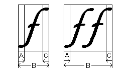
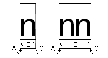

# Uniscribe Glossary

## ABC width

An ABC width is a composite value defined by a GDI [**ABC**](/windows/win32/api/wingdi/ns-wingdi-abc) structure. The structure contains members **abcA**, **abcB**, and **abcC**, corresponding to the "A", "B", and "C" widths of a [glyph](#glyph) or [run](#run).

The "A" width is [underhang](#underhang) (positive; also known as "padding") or [overhang](#overhang) (negative) to the left of the on-screen equivalent of ink that represents the glyph or run. The "B" width is the black width, the width from the leftmost ink to the rightmost ink. The "C" width is overhang to the right of the ink.

The following illustration shows an italic lowercase F with overhang to both its left and right. That is, the "A" and "C" widths here are both negative. See [underhang](#underhang) for an illustration of positive "A" and "C" widths.

When two or more glyphs are displayed as a unit, usually only the leftmost glyph contributes to the "A" width of the run, and only the rightmost glyph contributes to the "C" width of the run. However, this is not a strict rule. For example, if the first glyph in a run is a narrow letter and the second glyph is a wide diacritical mark, and they are handled as separate glyphs, the diacritical mark might actually extend beyond the letter.

## advance width

The advance width of a [glyph](#glyph) is the movement in the direction of writing from the starting point for rendering that glyph to the starting point for rendering the next glyph.

## bidirectional stack

The bidirectional stack is a 5-bit integer that keeps track of nesting levels between left-to-right and right-to-left text. It always starts at zero for left-to-right. Thus all even-numbered values represent left-to-right text and all odd-numbered values represent right-to-left text. The bidirectional stack is represented in the **uBidiLevel** member of a [**SCRIPT\_STATE**](/windows/win32/api/usp10/ns-usp10-script_state) structure.

## bidirectional text

Bidirectional text contains both left-to-right and right-to left portions, but the term is also sometimes loosely applied to pure right-to-left text. All right-to-left text requires the use of the [bidirectional stack](#bidirectional-stack), because the default [embedding level](#embedding-level) of zero implies left-to-right text.

## cell width

An application can justify text to fit a line by adjusting the cell width for certain glyphs. For unjustified text, the cell width for a glyph is the same as its [advance width](#advance-width).

## cluster

A cluster is the smallest linguistic unit that can be shaped. In languages such as Arabic and many of the Indic languages, the glyphs used to represent each character (Unicode code point) depend strongly on the surrounding code points, which constitute the cluster. In these languages, applications can translate code points into appropriate glyphs only by looking at the cluster. In some scripts, such as Devanagari, the order of glyphs within a cluster can differ from the order of the corresponding Unicode code points. For more information, see [Windows Glyph Processing](/typography/develop/processing-part1) on the Microsoft typography site.

## complex script

A complex script is a [script](#complex-script) with any of the following properties:

-   Allows bidirectional rendering.
-   Has contextual shaping.
-   Has combining characters.
-   Has specialized word-breaking and justification rules.
-   Filters out illegal character combinations.
-   Is not supported in the core Windows fonts and therefore might require [font fallback](#font-fallback).

In some complex scripts, the order of the glyphs might be quite different from the order of the underlying Unicode characters they represent. See [About Complex Scripts](about-complex-scripts.md) for more detail.

> [!Note]  
> In the context of typography, it is sometimes desirable to handle the Latin script used in writing English as a complex script. Examples include the Stylistic Alternates feature described in the documentation of [**OPENTYPE\_FEATURE\_RECORD**](/windows/desktop/api/Usp10/ns-usp10-opentype_feature_record), or ligatures, such as "fi", where a single glyph represents two or more consecutive characters.

 

## embedding level

In [bidirectional text](#bidirectional-text), the embedding level is the index of the [bidirectional stack](#bidirectional-stack).

## font fallback

Font fallback is automated selection of a font other than the font selected by the user in an application. In Uniscribe, font fallback is applied by the [**ScriptStringAnalyse**](/windows/desktop/api/Usp10/nf-usp10-scriptstringanalyse) function when all or part of the text is in a script that the user-selected font does not support.

## glyph

A glyph is a single unit of display in a font. For OpenType, this unit is defined by an outline. For other types of fonts, it can be defined by a bitmap, a set of graphic commands, and the like. A glyph does not necessarily correspond to a single character. For example, the "fi" ligature ("fi") represents the two characters "f" and "i". The Vietnamese lowercase "o" with circumflex and tilde ("ỗ") is typically composed from multiple glyphs.

## item

An item has a single [script](#complex-script) and direction. The [**ScriptItemize**](/windows/desktop/api/Usp10/nf-usp10-scriptitemize) or [**ScriptItemizeOpenType**](/windows/desktop/api/usp10/nf-usp10-scriptitemizeopentype) function can analyze a paragraph into items. An item is not necessarily a [run](#run). It can contain characters of multiple styles. Item and run information must be combined to determine [ranges](#range).

## LRM

LRM indicates the LEFT-TO-RIGHT MARK (Unicode code point U+200E). This mark specifies that characters following it in logical order should be rendered left-to-right.

## LTR

LTR indicates left-to-right.

## range

A range is a special case of a [run](#run). It falls entirely within one [item](#item). Thus, if an item is broken into runs, each of those runs is a range.

## RLM

RLM indicates the RIGHT-TO-LEFT MARK (Unicode code point U+200F). This mark indicates that characters following it in logical order should be rendered right-to-left.

## RTL

RTL indicates right-to-left.

## run

A run is a passage of text for Uniscribe to render. It should have a single style, that is, font, size, and color, but can be drawn from a variety of [scripts](#complex-script). A run can contain both left-to-right and right-to-left content.

## NADS

NADS indicates NATIONAL DIGIT SHAPES (Unicode code point U+206E. The term specifies that European digits (U+0030 through U+0039) should be rendered as national digits. See [Digit Shapes](digit-shapes.md) for further discussion of national digits.

## NODS

NODS indicates NOMINAL DIGIT SHAPES (Unicode code point U+206F). The term specifies that European digits (U+0030 through U+0039) should be rendered normally, not as national digits.

## overhang

The overhang is the part of the ink of a glyph that extends beyond the [advance width](#advance-width) of the glyph. Most glyphs (such as "H") have no overhang, as there is a little white space on either side to separate them from adjacent glyphs. An example of a glyph with overhang is the italic "f" used in this topic to illustrate [ABC width](#abc-width). Both the top and bottom of the italic "f" overhang the adjacent glyphs. Overhang corresponds to a negative "A" or "C" width.

## padding

See [underhang](#underhang).

## script

A script is a system of written language, for example, Latin script, Arabic script, Chinese script. A single script can apply to one or many human languages. The script has no particular relation to a font. For example, the Latin script can be rendered equally well by the Times New Roman or the Arial font.

## underhang

The underhang is a width of white space to the left or right of the solid portion of a glyph. Underhang corresponds to a positive "A" or "C" width, as described for [ABC width](#abc-width). Underhang is sometimes known as "padding". The following illustration shows the underhang for the lowercase letter n.

## Related topics

<dl> <dt>

[About Uniscribe](about-uniscribe.md)
</dt> </dl>

 

 
