# Appendix: Matrix Transforms

This topic provides a mathematical overview of matrix transforms for 2-D graphics. However, you don't need to know matrix math in order to use transforms in Direct2D. Read this topic if you are interested in the math; otherwise, feel free to skip this topic.

-   [Introduction to Matrices](#introduction-to-matrices)
    -   [Matrix Operations](#matrix-operations)
-   [Affine Transforms](#affine-transforms)
    -   [Translation Transform](#translation-transform)
    -   [Scaling Transform](#scaling-transform)
    -   [Rotation Around the Origin](#rotation-around-the-origin)
    -   [Rotation Around an Arbitrary Point](#rotation-around-an-arbitrary-point)
    -   [Skew Transform](#skew-transform)
-   [Representing Transforms in Direct2D](#representing-transforms-in-direct2d)
-   [Next](#next)

## Introduction to Matrices

A matrix is a rectangular array of real numbers. The *order* of the matrix is the number of rows and columns. For example, if the matrix has 3 rows and 2 columns, the order is 3 × 2. Matrices are usually shown with the matrix elements enclosed in square brackets:

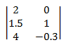

Notation: A matrix is designated by a capital letter. Elements are designated by lowercase letters. Subscripts indicate the row and column number of an element. For example, a*ij* is the element at the i'th row and j'th column of the matrix A.

The following diagram shows an i × j matrix, with the individual elements in each cell of the matrix.

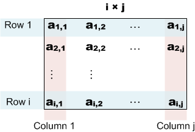

### Matrix Operations

This section describes the basic operations defined on matrices.

*Addition*. The sum A + B of two matrices is obtained by adding the corresponding elements of A and B:

<dl> A + B = \[ a*ij* \] + \[ b*ij* \] = \[ a*ij* + b*ij* \]  
</dl>

*Scalar multiplication*. This operation multiplies a matrix by a real number. Given a real number *k*, the scalar product kA is obtained by multiplying every element of A by *k*.

<dl> kA = k\[ a*ij* \] = \[ k × a*ij* \]  
</dl>

*Matrix multiplication*. Given two matrices A and B with order (m × n) and (n × p), the product C = A × B is a matrix with order (m × p), defined as follows:

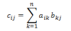

or, equivalently:

<dl> c*ij* = a*i*1 x b1*j* + a*i*2 x b2*j* + ... + a*in* + b*nj*  
</dl>

That is, to compute each element c*ij*, do the following:

1.  Take the i'th row of A and the j'th column of B.
2.  Multiply each pair of elements in the row and column: the first row entry by the first column entry, the second row entry by the second column entry, and so forth.
3.  Sum the result.

Here is an example of multiplying a (2 × 2) matrix by a (2 × 3) matrix.

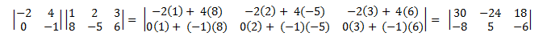

Matrix multiplication is not commutative. That is, A × B ≠ B × A. Also, from the definition it follows that not every pair of matrices can be multiplied. The number of columns in the left-hand matrix must equal the number of rows in the right-hand matrix. Otherwise, the × operator is not defined.

*Identify matrix*. An identity matrix, designated I, is a square matrix defined as follows:

<dl> I*ij* = 1 if *i* = *j*, or 0 otherwise.  
</dl>

In other words, an identity matrix contains 1 for each element where the row number equals the column number, and zero for all other elements. For example, here is the 3 × 3 identity matrix.

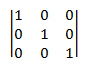

The following equalities hold for any matrix M.

<dl> M x I = M  
I x M = M  
</dl>

## Affine Transforms

An *affine transform* is a mathematical operation that maps one coordinate space to another. In other words, it maps one set of points to another set of points. Affine transforms have some features that make them useful in computer graphics.

-   Affine transforms preserve *collinearity*. If three or more points fall on a line, they still form a line after the transformation. Straight lines remain straight.
-   The composition of two affine transforms is an affine transform.

Affine transforms for 2-D space have the following form.

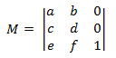

If you apply the definition of matrix multiplication given earlier, you can show that the product of two affine transforms is another affine transform. To transform a 2D point using an affine transform, the point is represented as a 1 × 3 matrix.

<dl> P = \| x y 1 \|  
</dl>

The first two elements contain the x and y coordinates of the point. The 1 is placed in the third element to make the math work out correctly. To apply the transform, multiply the two matrices as follows.

<dl> P' = P × M  
</dl>

This expands to the following.

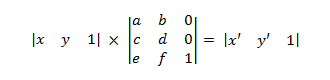

where

<dl> x' = ax + cy + e  
y' = bx + dy + f  
</dl>

To get the transformed point, take the first two elements of matrix P'.

<dl> p = (x', y') = (ax + cy + e, bx + dy + f)  
</dl>

> [!Note]  
> A 1 × *n* matrix is called a *row vector*. Direct2D and Direct3D both use row vectors to represent points in 2D or 3D space. You can get an equivalent result by using a column vector (*n* × 1) and transposing the transform matrix. Most graphics texts use the column vector form. This topic presents the row vector form for consistency with Direct2D and Direct3D.

 

The next several sections derive the basic transforms.

### Translation Transform

The translation transform matrix has the following form.

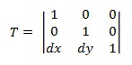

Plugging a point *P* into this equation yields:

<dl> P' = (*x* + *dx*, *y* + *dy*)  
</dl>

which corresponds to the point (x, y) translated by *dx* in the X-axis and *dy* in the Y-axis.

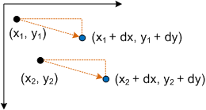

### Scaling Transform

The scaling transform matrix has the following form.

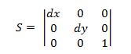

Plugging a point *P* into this equation yields:

<dl> P' = (*x* ∙ *dx*, *y* ∙ *dy*)  
</dl>

which corresponds to the point (x,y) scaled by *dx* and *dy*.

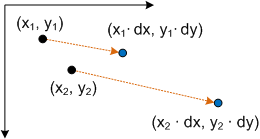

### Rotation Around the Origin

The matrix to rotate a point around the origin has the following form.

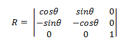

The transformed point is:

<dl> P' = (*x*cosΘ – ysinΘ, *x*sinΘ + *y*cosΘ)  
</dl>

Proof. To show that P' represents a rotation, consider the following diagram.

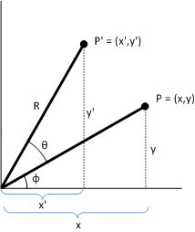

Given:

<dl> <dt>

P = (x,y)
</dt> <dd>

The original point to transform.

</dd> <dt>

Φ
</dt> <dd>

The angle formed by the line (0,0) to P.

</dd> <dt>

Θ
</dt> <dd>

The angle by which to rotate (x,y) about the origin.

</dd> <dt>

P' = (x',y')
</dt> <dd>

The transformed point.

</dd> <dt>

R
</dt> <dd>

The length of the line (0,0) to P. Also the radius of the circle of rotation.

</dd> </dl>

> [!Note]  
> This diagram uses the standard coordinate system used in geometry, where the positive y-axis points up. Direct2D uses the Windows coordinate system, where the positive y-axis points down.

 

The angle between the x-axis and the line (0,0) to P' is Φ + Θ. The following identities hold:

<dl> x = R cosΦ  
y = R sinΦ  
x' = R cos(Φ + Θ)  
y' = R sin(Φ+ Θ)  
</dl>

Now solve for x' and y' in terms of Θ. By the trigonometric addition formulas:

<dl> x' = R(cosΦcosΘ – sinΦsinΘ) = RcosΦcosΘ – RsinΦsinΘ  
y' = R(sinΦcosΘ + cosΦsinΘ) = RsinΦcosΘ + RcosΦsinΘ  
</dl>

Substituting, we get:

<dl> x' = xcosΘ – ysinΘ  
y' = xsinΘ + ycosΘ  
</dl>

which corresponds to the transformed point P' shown earlier.

### Rotation Around an Arbitrary Point

To rotate around a point (x,y) other than the origin, the following matrix is used.

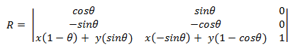

You can derive this matrix by taking the point (x,y) to be the origin.

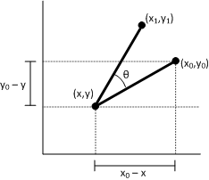

Let (x1, y1) be the point that results from rotating the point (x0, y0) around the point (x,y). We can derive x1 as follows.

<dl> x1 = (x0 – x)cosΘ– (y0 – y)sinΘ + x  
x1 = x0cosΘ – y0sinΘ + \[ (1 – cosΘ) + ysinΘ \]  
</dl>

Now plug this equation back into the transform matrix, using the formula x1 = ax0 + cy0 + e from earlier. Use the same procedure to derive y1.

### Skew Transform

The skew transform is defined by four parameters:

-   Θ: The amount to skew along the x-axis, measured as an angle from the y-axis.
-   Φ: The amount to skew along the y-axis, measured as an angle from the x-axis.
-   (*px*, *py*): The x- and y-coordinates of the point about which the skew is performed.

The skew transform uses the following matrix.

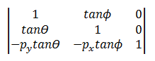

The transformed point is:

<dl> P' = (*x* + *y*tanΘ – *py*tanΘ, *y* + *x*tanΦ) – *py*tanΦ  
</dl>

or equivalently:

<dl> P' = (*x* + (*y* – *py*)tanΘ, *y* + (*x* – *px*)tanΦ)  
</dl>

To see how this transform works, consider each component individually. The Θ parameter moves every point in the x direction by an amount equal to tanΘ. The following diagram shows the relation between Θ and the x-axis skew.

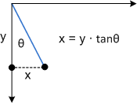

Here is the same skew applied to a rectangle:

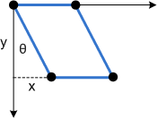

The Φ parameter has the same effect, but along the y-axis:

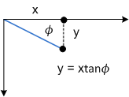

The next diagram shows y-axis skew applied to a rectangle.

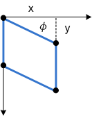

Finally, the parameters *px* and *py* shift the center point for the skew along the x- and y-axes.

## Representing Transforms in Direct2D

All Direct2D transforms are affine transforms. Direct2D does not support non-affine transforms. Transforms are represented by the [**D2D1\_MATRIX\_3X2\_F**](/windows/desktop/Direct2D/d2d1-matrix-3x2-f) structure. This structure defines a 3 × 2 matrix. Because the third column of an affine transform is always the same (\[0, 0, 1\]), and because Direct2D does not support non-affine transforms, there is no need to specify the entire 3 × 3 matrix. Internally, Direct2D uses 3 × 3 matrices to compute the transforms.

The members of the [**D2D1\_MATRIX\_3X2\_F**](/windows/desktop/Direct2D/d2d1-matrix-3x2-f) are named according to their index position: the **\_11** member is element (1,1), the **\_12** member is element (1,2), and so forth. Although you can initialize the structure members directly, it is recommended to use the [**D2D1::Matrix3x2F**](/windows/desktop/api/d2d1helper/nl-d2d1helper-matrix3x2f) class. This class inherits **D2D1\_MATRIX\_3X2\_F** and provides helper methods for creating any of the basic affine transforms. The class also defines [**operator\*()**](/windows/desktop/api/d2d1helper/nf-d2d1helper-matrix3x2f-operator-mult) for composing two or more transforms, as described in [Applying Transforms in Direct2D](applying-transforms-in-direct2d.md).

## Next

[Module 4. User Input](module-4--user-input.md)

 

 