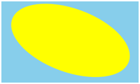
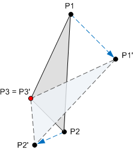
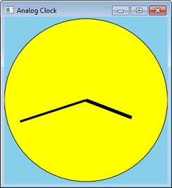
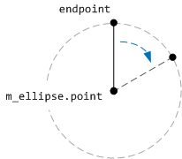
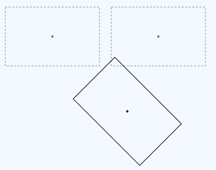

# Applying Transforms in Direct2D

In [Drawing with Direct2D](drawing-with-direct2d.md), we saw that the [**ID2D1RenderTarget::FillEllipse**](/windows/win32/api/d2d1/nf-d2d1-id2d1rendertarget-fillellipse(constd2d1_ellipse__id2d1brush)) method draws an ellipse that is aligned to the x- and y-axes. But suppose that you want to draw an ellipse tilted at an angle?



By using transforms, you can alter a shape in the following ways.

-   Rotation around a point.
-   Scaling.
-   Translation (displacement in the X or Y direction).
-   Skew (also known as *shear*).

A transform is a mathematical operation that maps a set of points to a new set of points. For example, the following diagram shows a triangle rotated around the point P3. After the rotation is applied, the point P1 is mapped to P1', the point P2 is mapped to P2', and the point P3 maps to itself.



Transforms are implemented by using matrices. However, you do not have to understand the mathematics of matrices in order to use them. If you want to learn more about the math, see [Appendix: Matrix Transforms](appendix--matrix-transforms.md).

To apply a transform in Direct2D, call the [**ID2D1RenderTarget::SetTransform**](/windows/desktop/Direct2D/id2d1rendertarget-settransform) method. This method takes a [**D2D1\_MATRIX\_3X2\_F**](/windows/desktop/Direct2D/d2d1-matrix-3x2-f) structure that defines the transformation. You can initialize this structure by calling methods on the [**D2D1::Matrix3x2F**](/windows/desktop/api/d2d1helper/nl-d2d1helper-matrix3x2f) class. This class contains static methods that return a matrix for each kind of transform:

-   [**Matrix3x2F::Rotation**](/windows/desktop/api/d2d1helper/nf-d2d1helper-matrix3x2f-rotation)
-   [**Matrix3x2F::Scale**](/windows/win32/api/d2d1helper/nf-d2d1helper-matrix3x2f-scale(d2d1_size_f_d2d1_point_2f))
-   [**Matrix3x2F::Translation**](/windows/win32/api/d2d1helper/nf-d2d1helper-matrix3x2f-translation(d2d1_size_f))
-   [**Matrix3x2F::Skew**](/windows/desktop/api/d2d1helper/nf-d2d1helper-matrix3x2f-skew)

For example, the following code applies a 20-degree rotation around the point (100, 100).


```C++
pRenderTarget->SetTransform(
    D2D1::Matrix3x2F::Rotation(20, D2D1::Point2F(100,100)));
```

The transform is applied to all later drawing operations until you call [**SetTransform**](/windows/desktop/Direct2D/id2d1rendertarget-settransform) again. To remove the current transform, call **SetTransform** with the identity matrix. To create the identity matrix, call the [**Matrix3x2F::Identity**](/windows/desktop/api/d2d1helper/nf-d2d1helper-identitymatrix) function.


```C++
pRenderTarget->SetTransform(D2D1::Matrix3x2F::Identity());
```

## Drawing Clock Hands

Let's put transforms to use by converting our Circle program into an analog clock. We can do this by adding lines for the hands.



Instead of calculating the coordinates for the lines, we can calculate the angle and then apply a rotation transform. The following code shows a function that draws one clock hand. The *fAngle* parameter gives the angle of the hand, in degrees.

```C++
void Scene::DrawClockHand(float fHandLength, float fAngle, float fStrokeWidth)
{
    m_pRenderTarget->SetTransform(
        D2D1::Matrix3x2F::Rotation(fAngle, m_ellipse.point)
            );

    // endPoint defines one end of the hand.
    D2D_POINT_2F endPoint = D2D1::Point2F(
        m_ellipse.point.x,
        m_ellipse.point.y - (m_ellipse.radiusY * fHandLength)
        );

    // Draw a line from the center of the ellipse to endPoint.
    m_pRenderTarget->DrawLine(
        m_ellipse.point, endPoint, m_pStroke, fStrokeWidth);
}
```

This code draws a vertical line, starting from the center of the clock face and ending at the point *endPoint*. The line is rotated around the center of the ellipse by applying a rotation transform. The center point for the rotation is the center of ellipse that forms the clock face.



The following code shows how the whole clock face is drawn.

```C++
void Scene::RenderScene()
{
    m_pRenderTarget->Clear(D2D1::ColorF(D2D1::ColorF::SkyBlue));

    m_pRenderTarget->FillEllipse(m_ellipse, m_pFill);
    m_pRenderTarget->DrawEllipse(m_ellipse, m_pStroke);

    // Draw hands
    SYSTEMTIME time;
    GetLocalTime(&time);

    // 60 minutes = 30 degrees, 1 minute = 0.5 degree
    const float fHourAngle = (360.0f / 12) * (time.wHour) + (time.wMinute * 0.5f);
    const float fMinuteAngle =(360.0f / 60) * (time.wMinute);

    DrawClockHand(0.6f,  fHourAngle,   6);
    DrawClockHand(0.85f, fMinuteAngle, 4);

    // Restore the identity transformation.
    m_pRenderTarget->SetTransform( D2D1::Matrix3x2F::Identity() );
}
```

You can download the complete Visual Studio project from [Direct2D Clock Sample](direct2d-clock-sample.md). (Just for fun, the download version adds a radial gradiant to the clock face.)

## Combining Transforms

The four basic transforms can be combined by multiplying two or more matrices. For example, the following code combines a rotation with a translation.

```C++
const D2D1::Matrix3x2F rot = D2D1::Matrix3x2F::Rotation(20);
const D2D1::Matrix3x2F trans = D2D1::Matrix3x2F::Translation(40, 10);

pRenderTarget->SetTransform(rot * trans);
```

The [**Matrix3x2F**](/windows/desktop/api/d2d1helper/nl-d2d1helper-matrix3x2f) class provides [**operator\*()**](/windows/desktop/api/d2d1helper/nf-d2d1helper-matrix3x2f-operator-mult) for matrix multiplication. The order in which you multiply the matrices is important. Setting a transform (M × N) means "Apply M first, followed by N." For example, here is rotation followed by translation:


Here is the code for this transform:

```C++
const D2D1::Matrix3x2F rot = D2D1::Matrix3x2F::Rotation(45, center);
const D2D1::Matrix3x2F trans = D2D1::Matrix3x2F::Translation(x, 0);
pRenderTarget->SetTransform(rot * trans);
```

Now compare that transform with a transform in the reverse order, translation followed by rotation.



The rotation is performed around the center of the original rectangle. Here is the code for this transform.

```C++
D2D1::Matrix3x2F rot = D2D1::Matrix3x2F::Rotation(45, center);
D2D1::Matrix3x2F trans = D2D1::Matrix3x2F::Translation(x, 0);
pRenderTarget->SetTransform(trans * rot);
```

As you can see, the matrices are the same, but the order of operations has changed. This happens because matrix multiplication is not commutative: M × N ≠ N × M.

## Next

[Appendix: Matrix Transforms](appendix--matrix-transforms.md)