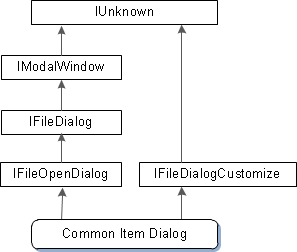
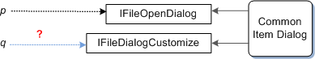

# Asking an Object for an Interface

We saw earlier that an object can implement more than one interface. The Common Item Dialog object is a real-world example of this. To support the most typical uses, the object implements the [**IFileOpenDialog**](/windows/desktop/api/shobjidl_core/nn-shobjidl_core-ifileopendialog) interface. This interface defines basic methods for displaying the dialog box and getting information about the selected file. For more advanced use, however, the object also implements an interface named [**IFileDialogCustomize**](/windows/desktop/api/shobjidl_core/nn-shobjidl_core-ifiledialogcustomize). A program can use this interface to customize the appearance and behavior of the dialog box, by adding new UI controls.

Recall that every COM interface must inherit, directly or indirectly, from the [**IUnknown**](/windows/desktop/api/unknwn/nn-unknwn-iunknown) interface. The following diagram shows the inheritance of the Common Item Dialog object.



As you can see from the diagram, the direct ancestor of [**IFileOpenDialog**](/windows/desktop/api/shobjidl_core/nn-shobjidl_core-ifileopendialog) is the [**IFileDialog**](/windows/desktop/api/shobjidl_core/nn-shobjidl_core-ifiledialog) interface, which in turn inherits [**IModalWindow**](/windows/desktop/api/shobjidl_core/nn-shobjidl_core-imodalwindow). As you go up the inheritance chain from **IFileOpenDialog** to **IModalWindow**, the interfaces define increasingly generalized window functionality. Finally, the **IModalWindow** interface inherits [**IUnknown**](/windows/desktop/api/unknwn/nn-unknwn-iunknown). The Common Item Dialog object also implements [**IFileDialogCustomize**](/windows/desktop/api/shobjidl_core/nn-shobjidl_core-ifiledialogcustomize), which exists in a separate inheritance chain.

Now suppose that you have a pointer to the [**IFileOpenDialog**](/windows/desktop/api/shobjidl_core/nn-shobjidl_core-ifileopendialog) interface. How would you get a pointer to the [**IFileDialogCustomize**](/windows/desktop/api/shobjidl_core/nn-shobjidl_core-ifiledialogcustomize) interface?



Simply casting the [**IFileOpenDialog**](/windows/desktop/api/shobjidl_core/nn-shobjidl_core-ifileopendialog) pointer to an [**IFileDialogCustomize**](/windows/desktop/api/shobjidl_core/nn-shobjidl_core-ifiledialogcustomize) pointer will not work. There is no reliable way to "cross cast" across an inheritance hierarchy, without some form of run-time type information (RTTI), which is a highly language-dependent feature.

The COM approach is to *ask* the object to give you an [**IFileDialogCustomize**](/windows/desktop/api/shobjidl_core/nn-shobjidl_core-ifiledialogcustomize) pointer, using the first interface as a conduit into the object. This is done by calling the [**IUnknown::QueryInterface**](/windows/desktop/api/unknwn/nf-unknwn-iunknown-queryinterface(q)) method from the first interface pointer. You can think of **QueryInterface** as a language-independent version of the **dynamic\_cast** keyword in C++.

The [**QueryInterface**](/windows/desktop/api/unknwn/nf-unknwn-iunknown-queryinterface(q)) method has the following signature:

``` syntax
HRESULT QueryInterface(REFIID riid, void **ppvObject);
```

Based on what you already know about [**CoCreateInstance**](/windows/desktop/api/combaseapi/nf-combaseapi-cocreateinstance), you might be able to guess how [**QueryInterface**](/windows/desktop/api/unknwn/nf-unknwn-iunknown-queryinterface(q)) works.

-   The *riid* parameter is the GUID that identifies the interface you are asking for. The data type **REFIID** is a **typedef** for `const GUID&`. Notice that the class identifier (CLSID) is not required, because the object has already been created. Only the interface identifier is necessary.
-   The *ppvObject* parameter receives a pointer to the interface. The data type of this parameter is **void\*\***, for the same reason that [**CoCreateInstance**](/windows/desktop/api/combaseapi/nf-combaseapi-cocreateinstance) uses this data type: [**QueryInterface**](/windows/desktop/api/unknwn/nf-unknwn-iunknown-queryinterface(q)) can be used to query for any COM interface, so the parameter cannot be strongly typed.

Here is how you would call [**QueryInterface**](/windows/desktop/api/unknwn/nf-unknwn-iunknown-queryinterface(q)) to get an [**IFileDialogCustomize**](/windows/desktop/api/shobjidl_core/nn-shobjidl_core-ifiledialogcustomize) pointer:


```C++
hr = pFileOpen->QueryInterface(IID_IFileDialogCustomize, 
    reinterpret_cast<void**>(&pCustom));
if (SUCCEEDED(hr))
{
    // Use the interface. (Not shown.)
    // ...

    pCustom->Release();
}
else
{
    // Handle the error.
}
```


As always, check the **HRESULT** return value, in case the method fails. If the method succeeds, you must call [**Release**](/windows/desktop/api/unknwn/nf-unknwn-iunknown-release) when you are done using the pointer, as described in [Managing the Lifetime of an Object](managing-the-lifetime-of-an-object.md).

## Next

[Memory Allocation in COM](memory-allocation-in-com.md)

 

 