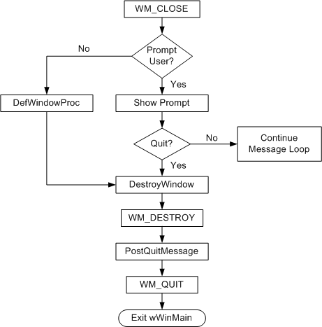

# Closing the Window

When the user closes a window, that action triggers a sequence of window messages.

The user can close an application window by clicking the **Close** button, or by using a keyboard shortcut such as ALT+F4. Any of these actions causes the window to receive a [**WM\_CLOSE**](https://msdn.microsoft.com/library/windows/desktop/ms632617) message. The **WM\_CLOSE** message gives you an opportunity to prompt the user before closing the window. If you really do want to close the window, call the [**DestroyWindow**](https://msdn.microsoft.com/library/windows/desktop/ms632682) function. Otherwise, simply return zero from the **WM\_CLOSE** message, and the operating system will ignore the message and not destroy the window.

Here is an example of how a program might handle [**WM\_CLOSE**](https://msdn.microsoft.com/library/windows/desktop/ms632617).


```C++
case WM_CLOSE:
    if (MessageBox(hwnd, L"Really quit?", L"My application", MB_OKCANCEL) == IDOK)
    {
        DestroyWindow(hwnd);
    }
    // Else: User canceled. Do nothing.
    return 0;
```


In this example, the [**MessageBox**](https://msdn.microsoft.com/library/windows/desktop/ms645505) function shows a modal dialog that contains **OK** and **Cancel** buttons. If the user clicks **OK**, the program calls [**DestroyWindow**](https://msdn.microsoft.com/library/windows/desktop/ms632682). Otherwise, if the user clicks **Cancel**, the call to **DestroyWindow** is skipped, and the window remains open. In either case, return zero to indicate that you handled the message.

If you want to close the window without prompting the user, you could simply call [**DestroyWindow**](https://msdn.microsoft.com/library/windows/desktop/ms632682) without the call to [**MessageBox**](https://msdn.microsoft.com/library/windows/desktop/ms645505). However, there is a shortcut in this case. Recall that [**DefWindowProc**](https://msdn.microsoft.com/library/windows/desktop/ms633572) executes the default action for any window message. In the case of [**WM\_CLOSE**](https://msdn.microsoft.com/library/windows/desktop/ms632617), **DefWindowProc** automatically calls **DestroyWindow**. That means if you ignore the **WM\_CLOSE** message in your **switch** statement, the window is destroyed by default.

When a window is about to be destroyed, it receives a [**WM\_DESTROY**](https://msdn.microsoft.com/library/windows/desktop/ms632620) message. This message is sent after the window is removed from the screen, but before the destruction occurs (in particular, before any child windows are destroyed).

In your main application window, you will typically respond to [**WM\_DESTROY**](https://msdn.microsoft.com/library/windows/desktop/ms632620) by calling [**PostQuitMessage**](https://msdn.microsoft.com/library/windows/desktop/ms644945).


```C++
    case WM_DESTROY:
        PostQuitMessage(0);
        return 0;
```


We saw in the [Window Messages](window-messages.md) section that [**PostQuitMessage**](https://msdn.microsoft.com/library/windows/desktop/ms644945) puts a [**WM\_QUIT**](https://msdn.microsoft.com/library/windows/desktop/ms632641) message on the message queue, causing the message loop to end.

Here is a flow chart showing the typical way to process [**WM\_CLOSE**](https://msdn.microsoft.com/library/windows/desktop/ms632617) and [**WM\_DESTROY**](https://msdn.microsoft.com/library/windows/desktop/ms632620) messages:



## Next

[Managing Application State](managing-application-state-.md)

 

 


