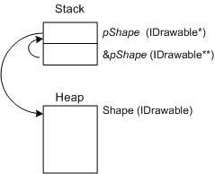

# Creating an Object in COM

After a thread has initialized the COM library, it is safe for the thread to use COM interfaces. To use a COM interface, your program first creates an instance of an object that implements that interface.

In general, there are two ways to create a COM object:

-   The module that implements the object might provide a function specifically designed to create instances of that object.
-   Alternatively, COM provides a generic creation function named [**CoCreateInstance**](/windows/desktop/api/combaseapi/nf-combaseapi-cocreateinstance).

For example, take the hypothetical `Shape` object from the topic [What Is a COM Interface?](what-is-a-com-interface-.md). In that example, the `Shape` object implements an interface named `IDrawable`. The graphics library that implements the `Shape` object might export a function with the following signature.


```C++
// Not an actual Windows function. 

HRESULT CreateShape(IDrawable** ppShape);
```


Given this function, you could create a new `Shape` object as follows.


```C++
IDrawable *pShape;

HRESULT hr = CreateShape(&pShape);
if (SUCCEEDED(hr))
{
    // Use the Shape object.
}
else
{
    // An error occurred.
}
```


The *ppShape* parameter is of type pointer-to-pointer-to-`IDrawable`. If you have not seen this pattern before, the double indirection might be puzzling.

Consider the requirements of the `CreateShape` function. The function must give an `IDrawable` pointer back to the caller. But the function's return value is already used for the error/success code. Therefore, the pointer must be returned through an argument to the function. The caller will pass a variable of type `IDrawable*` to the function, and the function will overwrite this variable with a new `IDrawable` pointer. In C++, there are only two ways for a function to overwrite a parameter value: pass by reference, or pass by address. COM uses the latter, pass-by-address. And the address of a pointer is a pointer-to-a-pointer, so the parameter type must be `IDrawable**`.

Here is a diagram to help visualize what's going on.



The `CreateShape` function uses the address of *pShape* (`&pShape`) to write a new pointer value to *pShape*.

## CoCreateInstance: A Generic Way to Create Objects

The [**CoCreateInstance**](/windows/desktop/api/combaseapi/nf-combaseapi-cocreateinstance) function provides a generic mechanism for creating objects. To understand **CoCreateInstance**, keep in mind that two COM objects can implement the same interface, and one object can implement two or more interfaces. Thus, a generic function that creates objects needs two pieces of information.

-   Which object to create.
-   Which interface to get from the object.

But how do we indicate this information when we call the function? In COM, an object or an interface is identified by assigning it a 128-bit number, called a *globally unique identifier* (GUID). GUIDs are generated in a way that makes them effectively unique. GUIDs are a solution to the problem of how to create unique identifiers without a central registration authority. GUIDs are sometimes called *universally unique identifiers* (UUIDs). Prior to COM, they were used in DCE/RPC (Distributed Computing Environment/Remote Procedure Call). Several algorithms exist for creating new GUIDs. Not all of these algorithms strictly guarantee uniqueness, but the probability of accidentally creating the same GUID value twice is extremely small—effectively zero. GUIDs can be used to identify any sort of entity, not just objects and interfaces. However, that is the only use that concerns us in this module.

For example, the `Shapes` library might declare two GUID constants:


```C++
extern const GUID CLSID_Shape;
extern const GUID IID_IDrawable; 
```


(You can assume that the actual 128-bit numeric values for these constants are defined elsewhere.) The constant **CLSID\_Shape** identifies the `Shape` object, while the constant **IID\_IDrawable** identifies the `IDrawable` interface. The prefix "CLSID" stands for *class identifier*, and the prefix *IID* stands for *interface identifier*. These are standard naming conventions in COM.

Given these values, you would create a new `Shape` instance as follows:


```C++
IDrawable *pShape;
hr = CoCreateInstance(CLSID_Shape, NULL, CLSCTX_INPROC_SERVER, IID_IDrawable,
     reinterpret_cast<void**>(&pShape));

if (SUCCEEDED(hr))
{
    // Use the Shape object.
}
else
{
    // An error occurred.
}
```


The [**CoCreateInstance**](/windows/desktop/api/combaseapi/nf-combaseapi-cocreateinstance) function has five parameters. The first and fourth parameters are the class identifier and interface identifier. In effect, these parameters tell the function, "Create the Shape object, and give me a pointer to the IDrawable interface."

Set the second parameter to **NULL**. (For more information about the meaning of this parameter, see the topic [Aggregation](/windows/desktop/com/aggregation) in the COM documentation.) The third parameter takes a set of flags whose main purpose is to specify the *execution context* for the object. The execution context specifies whether the object runs in the same process as the application; in a different process on the same computer; or on a remote computer. The following table shows the most common values for this parameter.


| Flag                       | Description                                                                                                                                                        |
|----------------------------|--------------------------------------------------------------------------------------------------------------------------------------------------------------------|
| **CLSCTX\_INPROC\_SERVER** | Same process.                                                                                                                                                      |
| **CLSCTX\_LOCAL\_SERVER**  | Different process, same computer.                                                                                                                                  |
| **CLSCTX\_REMOTE\_SERVER** | Different computer.                                                                                                                                                |
| **CLSCTX\_ALL**            | Use the most efficient option that the object supports. (The ranking, from most efficient to least efficient, is: in-process, out-of-process, and cross-computer.) |


 

The documentation for a particular component might tell you which execution context the object supports. If not, use **CLSCTX\_ALL**. If you request an execution context that the object does not support, the [**CoCreateInstance**](/windows/desktop/api/combaseapi/nf-combaseapi-cocreateinstance) function returns the error code **REGDB\_E\_CLASSNOTREG**. This error code can also indicate that the CLSID does not correspond to any component registered on the user's computer.

The fifth parameter to [**CoCreateInstance**](/windows/desktop/api/combaseapi/nf-combaseapi-cocreateinstance) receives a pointer to the interface. Because **CoCreateInstance** is a generic mechanism, this parameter cannot be strongly typed. Instead, the data type is **void\*\***, and the caller must coerce the address of the pointer to a **void\*\*** type. That is the purpose of the **reinterpret\_cast** in the previous example.

It is crucial to check the return value of [**CoCreateInstance**](/windows/desktop/api/combaseapi/nf-combaseapi-cocreateinstance). If the function returns an error code, the COM interface pointer is invalid, and attempting to dereference it can cause your program to crash.

Internally, the [**CoCreateInstance**](/windows/desktop/api/combaseapi/nf-combaseapi-cocreateinstance) function uses various techniques to create an object. In the simplest case, it looks up the class identifier in the registry. The registry entry points to a DLL or EXE that implements the object. **CoCreateInstance** can also use information from a COM+ catalog or a side-by-side (SxS) manifest. Regardless, the details are transparent to the caller. For more information about the internal details of **CoCreateInstance**, see [COM Clients and Servers](/windows/desktop/com/com-clients-and-servers).

The `Shapes` example that we have been using is somewhat contrived, so now let's turn to a real-world example of COM in action: displaying the **Open** dialog box for the user to select a file.

## Next

[Example: The Open Dialog Box](example--the-open-dialog-box.md)

 

 
