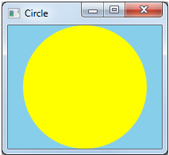

# Direct2D Circle Sample

This sample application shows how to draw a circle using Direct2D.

## Description

The Direct2D Circle sample application draws a circle, as shown in the screen shot that follows. This sample is discussed in [Module 3: Windows Graphics](module-3---windows-graphics.md).

## Downloading the Sample

This sample is available in the MSDN Code Gallery at [http://go.microsoft.com/fwlink/p/?linkid=195524]( http://go.microsoft.com/fwlink/p/?linkid=195524).

## Related topics

<dl> <dt>

[Learn to Program for Windows: Sample Code](learn-to-program-for-windows--sample-code.md)
</dt> <dt>

[First Direct2D Program](your-first-direct2d-program.md)
</dt> <dt>

[Module 3: Windows Graphics](module-3---windows-graphics.md)
</dt> </dl>

 

 

