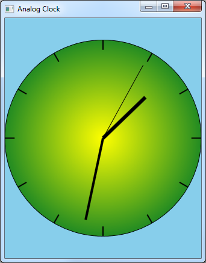

# Direct2D Clock Sample

This sample application shows how to use transforms in Direct2D to draw the hands of a clock.

## Description

The Direct2D Clock sample application draws an analog clock, as shown in the screen shot that follows. This sample is discussed in [Applying Transforms in Direct2D](applying-transforms-in-direct2d.md).

## Downloading the Sample

This sample is available [here](https://github.com/microsoft/Windows-classic-samples/tree/master/Samples/Win7Samples/begin/LearnWin32/Direct2DClock).

## Related topics

<dl> <dt>

[Learn to Program for Windows: Sample Code](learn-to-program-for-windows--sample-code.md)
</dt> <dt>

[Applying Transforms in Direct2D](applying-transforms-in-direct2d.md)
</dt> <dt>

[Module 3: Windows Graphics](module-3---windows-graphics.md)
</dt> </dl>

 

 

