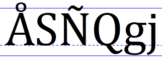

# DPI and device-independent pixels

To program effectively with Windows graphics, you must understand two related concepts:

-   Dots per inch (DPI)
-   Device-independent pixel (DIPs).

Let's start with DPI. This will require a short detour into typography. In typography, the size of type is measured in units called *points*. One point equals 1/72 of an inch.

<dl> 1 pt = 1/72 inch  
</dl>

> [!NOTE]  
> This is the desktop publishing definition of point. Historically, the exact measure of a point has varied.

For example, a 12-point font is designed to fit within a 1/6" (12/72) line of text. Obviously, this does not mean that every character in the font is exactly 1/6" tall. In fact, some characters might be taller than 1/6". For example, in many fonts the character Å is taller than the nominal height of the font. To display correctly, the font needs some additional space between the text. This space is called the *leading*.

The following illustration shows a 72-point font. The solid lines show a 1" tall bounding box around the text. The dashed line is called the *baseline*. Most of the characters in a font rest on the baseline. The height of the font includes the portion above the baseline (the *ascent*) and the portion below the baseline (the *descent*). In the font shown here, the ascent is 56 points and the descent is 16 points.



When it comes to a computer display, however, measuring text size is problematic, because pixels are not all the same size. The size of a pixel depends on two factors: the display resolution, and the physical size of the monitor. Therefore, physical inches are not a useful measure, because there is no fixed relation between physical inches and pixels. Instead, fonts are measured in *logical* units. A 72-point font is defined to be one logical inch tall. Logical inches are then converted to pixels. For many years, Windows used the following conversion: One logical inch equals 96 pixels. Using this scaling factor, a 72-point font is rendered as 96 pixels tall. A 12-point font is 16 pixels tall.

<dl> 12 points = 12/72 logical inch = 1/6 logical inch = 96/6 pixels = 16 pixels  
</dl>

This scaling factor is described as 96 dots per inch (DPI). The term dots derives from printing, where physical dots of ink are put onto paper. For computer displays, it would be more accurate to say 96 pixels per logical inch, but the term DPI has stuck.

Because actual pixel sizes vary, text that is readable on one monitor might be too small on another monitor. Also, people have different preferences—some people prefer larger text. For this reason, Windows enables the user to change the DPI setting. For example, if the user sets the display to 144 DPI, a 72-point font is 144 pixels tall. The standard DPI settings are 100% (96 DPI), 125% (120 DPI), and 150% (144 DPI). The user can also apply a custom setting. Starting in Windows 7, DPI is a per-user setting.

## DWM scaling

If a program does not account for DPI, the following defects might be apparent at high-DPI settings:

-   Clipped UI elements.
-   Incorrect layout.
-   Pixelated bitmaps and icons.
-   Incorrect mouse coordinates, which can affect hit testing, drag and drop, and so forth.

To ensure that older programs work at high-DPI settings, the DWM implements a useful fallback. If a program is not marked as being DPI aware, the DWM will scale the entire UI to match the DPI setting. For example, at 144 DPI, the UI is scaled by 150%, including text, graphics, controls, and window sizes. If the program creates a 500 × 500 window, the window actually appears as 750 × 750 pixels, and the contents of the window are scaled accordingly.

This behavior means that older programs "just work" at high-DPI settings. However, scaling also results in a somewhat blurry appearance, because the scaling is applied after the window is drawn.

## DPI-aware applications

To avoid DWM scaling, a program can mark itself as DPI-aware. This tells the DWM not to perform any automatic DPI scaling. All new applications should be designed to be DPI-aware, because DPI awareness improves the appearance of the UI at higher DPI settings.

A program declares itself DPI-aware through its application manifest. A *manifest* is a simply an XML file that describes a DLL or application. The manifest is typically embedded in the executable file, although it can be provided as a separate file. A manifest contains information such as DLL dependencies, the requested privilege level, and what version of Windows the program was designed for.

To declare that your program is DPI-aware, include the following information in the manifest.

``` syntax
<assembly xmlns="urn:schemas-microsoft-com:asm.v1" manifestVersion="1.0" xmlns:asmv3="urn:schemas-microsoft-com:asm.v3" >
  <asmv3:application>
    <asmv3:windowsSettings xmlns="http://schemas.microsoft.com/SMI/2005/WindowsSettings">
      <dpiAware>true</dpiAware>
    </asmv3:windowsSettings>
  </asmv3:application>
</assembly>
```

The listing shown here is only a partial manifest, but the Visual Studio linker generates the rest of the manifest for you automatically. To include a partial manifest in your project, perform the following steps in Visual Studio.

1.  On the **Project** menu, click **Property**.
2.  In the left pane, expand **Configuration Properties**, expand **Manifest Tool**, and then click **Input and Output**.
3.  In the **Additional Manifest Files** text box, type the name of the manifest file, and then click **OK**.

By marking your program as DPI-aware, you are telling the DWM not to scale your application window. Now if you create a 500 × 500 window, the window will occupy 500 × 500 pixels, regardless of the user's DPI setting.

## GDI and DPI

GDI drawing is measured in pixels. That means if your program is marked as DPI-aware, and you ask GDI to draw a 200 × 100 rectangle, the resulting rectangle will be 200 pixels wide and 100 pixels tall on the screen. However, GDI font sizes are scaled to the current DPI setting. In other words, if you create a 72-point font, the size of the font will be 96 pixels at 96 DPI, but 144 pixels at 144 DPI. Here is a 72 point font rendered at 144 DPI using GDI.


If your application is DPI-aware and you use GDI for drawing, scale all of your drawing coordinates to match the DPI.

## Direct2D and DPI

Direct2D automatically performs scaling to match the DPI setting. In Direct2D, coordinates are measured in units called *device-independent pixels* (DIPs). A DIP is defined as 1/96th of a *logical* inch. In Direct2D, all drawing operations are specified in DIPs and then scaled to the current DPI setting.

| DPI setting | DIP size    |
|-------------|-------------|
| 96          | 1 pixel     |
| 120         | 1.25 pixels |
| 144         | 1.5 pixels  |

For example, if the user's DPI setting is 144 DPI, and you ask Direct2D to draw a 200 × 100 rectangle, the rectangle will be 300 × 150 physical pixels. In addition, DirectWrite measures font sizes in DIPs, rather than points. To create a 12-point font, specify 16 DIPs (12 points = 1/6 logical inch = 96/6 DIPs). When the text is drawn on the screen, Direct2D converts the DIPs to physical pixels. The benefit of this system is that the units of measurement are consistent for both text and drawing, regardless of the current DPI setting.

A word of caution: Mouse and window coordinates are still given in physical pixels, not DIPs. For example, if you process the [**WM\_LBUTTONDOWN**](/windows/desktop/inputdev/wm-lbuttondown) message, the mouse-down position is given in physical pixels. To draw a point at that position, you must convert the pixel coordinates to DIPs.

## Converting physical pixels to DIPs

The base value of DPI is defined as `USER_DEFAULT_SCREEN_DPI` which is set to 96.  To determine the scaling factor for a monitor, take the DPI value and divide by `USER_DEFAULT_SCREEN_DPI`.

The conversion from physical pixels to DIPs uses the following formula.

`DIPs = pixels / (DPI / USER_DEFAULT_SCREEN_DPI)`

To get the DPI setting, call the [**GetDpiForWindow**](/windows/win32/api/winuser/nf-winuser-getdpiforwindow) function. The DPI is returned as a floating-point value. Calculate the scaling factor for both axes.

```cpp
float g_DPIScale = 1.0f;

void InitializeDPIScale(HWND hwnd)
{
    float dpi = GetDpiForWindow(hwnd);
    g_DPIScale = dpi / USER_DEFAULT_SCREEN_DPI;
}

template <typename T>
float PixelsToDipsX(T x)
{
    return static_cast<float>(x) / g_DPIScale;
}

template <typename T>
float PixelsToDips(T y)
{
    return static_cast<float>(y) / g_DPIScale;
}
```

Here is an alternate way to get the DPI setting if you are not using Direct2D:

```cpp
void InitializeDPIScale(HWND hwnd)
{
    HDC hdc = GetDC(hwnd);
    g_DPIScaleX = GetDeviceCaps(hdc, LOGPIXELSX) / USER_DEFAULT_SCREEN_DPI;
    g_DPIScaleY = GetDeviceCaps(hdc, LOGPIXELSY) / USER_DEFAULT_SCREEN_DPI;
    ReleaseDC(hwnd, hdc);
}
```

> [!NOTE]  
> We recommendation that for a desktop app, you use [GetDpiForWindow](/windows/win32/api/winuser/nf-winuser-getdpiforwindow); and for a Universal Windows Platform (UWP) app, use [DisplayInformation::LogicalDpi](/uwp/api/windows.graphics.display.displayinformation.logicaldpi). Although we don't recommended it, it''s possible to set the default DPI awareness programmatically using [**SetProcessDpiAwarenessContext**](/windows/win32/api/winuser/nf-winuser-setprocessdpiawarenesscontext). Once a window (an HWND) has been created in your process, changing the DPI awareness mode is no longer supported. If you are setting the process-default DPI awareness mode programmatically, then you must call the corresponding API before any HWNDs have been created. For more info, see [Setting the default DPI awareness for a process](../hidpi/setting-the-default-dpi-awareness-for-a-process.md).

## Resizing the render target

If the size of the window changes, you must resize the render target to match. In most cases, you will also need to update the layout and repaint the window. The following code shows these steps.

```cpp
void MainWindow::Resize()
{
    if (pRenderTarget != NULL)
    {
        RECT rc;
        GetClientRect(m_hwnd, &rc);

        D2D1_SIZE_U size = D2D1::SizeU(rc.right, rc.bottom);

        pRenderTarget->Resize(size);
        CalculateLayout();
        InvalidateRect(m_hwnd, NULL, FALSE);
    }
}
```

The [**GetClientRect**](/windows/desktop/api/winuser/nf-winuser-getclientrect) function gets the new size of the client area, in physical pixels (not DIPs). The [**ID2D1HwndRenderTarget::Resize**](../direct2d/id2d1hwndrendertarget-resize.md) method updates the size of the render target, also specified in pixels. The [**InvalidateRect**](/windows/desktop/api/winuser/nf-winuser-invalidaterect) function forces a repaint by adding the entire client area to the window's update region. (See [Painting the Window](painting-the-window.md), in Module 1.)

As the window grows or shrinks, you will typically need to recalculate the position of the objects that you draw. For example, in the circle program, the radius and center point must be updated:

```cpp
void MainWindow::CalculateLayout()
{
    if (pRenderTarget != NULL)
    {
        D2D1_SIZE_F size = pRenderTarget->GetSize();
        const float x = size.width / 2;
        const float y = size.height / 2;
        const float radius = min(x, y);
        ellipse = D2D1::Ellipse(D2D1::Point2F(x, y), radius, radius);
    }
}
```

The [**ID2D1RenderTarget::GetSize**](/windows/desktop/api/d2d1/nf-d2d1-id2d1rendertarget-getsize) method returns the size of the render target in DIPs (not pixels), which is the appropriate unit for calculating layout. There is a closely related method, [**ID2D1RenderTarget::GetPixelSize**](/windows/desktop/api/d2d1/nf-d2d1-id2d1rendertarget-getpixelsize), that returns the size in physical pixels. For an **HWND** render target, this value matches the size returned by [**GetClientRect**](/windows/desktop/api/winuser/nf-winuser-getclientrect). But remember that drawing is performed in DIPs, not pixels.

## Next

[Using color in Direct2D](using-color-in-direct2d.md)
