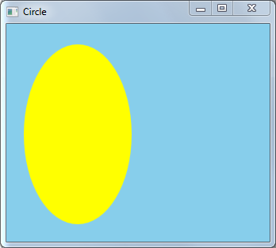

# Draw Circle Sample

This sample application shows how to use mouse input to draw a circle.

## Downloading the Sample

This sample is available [here](https://github.com/microsoft/Windows-classic-samples/tree/master/Samples/Win7Samples/begin/LearnWin32/DrawCircle).

## Related topics

* [Learn to Program for Windows: Sample Code](learn-to-program-for-windows--sample-code.md)
* [Module 4. User Input](module-4--user-input.md)
