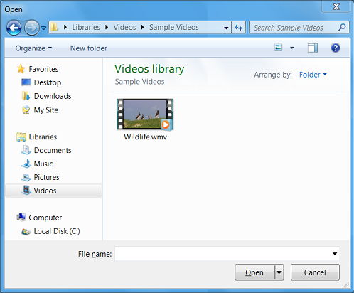

# Example: The Open Dialog Box

The `Shapes` example that we have been using is somewhat contrived. Let's turn to a COM object that you might use in a real Windows program: the **Open** dialog box.



To show the **Open** dialog box, a program can use a COM object called the Common Item Dialog object. The Common Item Dialog implements an interface named [**IFileOpenDialog**](/windows/desktop/api/shobjidl_core/nn-shobjidl_core-ifileopendialog), which is declared in the header file Shobjidl.h.

Here is a program that displays the **Open** dialog box to the user. If the user selects a file, the program shows a dialog box that contains the file name.


```C++
#include <windows.h>
#include <shobjidl.h> 

int WINAPI wWinMain(HINSTANCE hInstance, HINSTANCE, PWSTR pCmdLine, int nCmdShow)
{
    HRESULT hr = CoInitializeEx(NULL, COINIT_APARTMENTTHREADED | 
        COINIT_DISABLE_OLE1DDE);
    if (SUCCEEDED(hr))
    {
        IFileOpenDialog *pFileOpen;

        // Create the FileOpenDialog object.
        hr = CoCreateInstance(CLSID_FileOpenDialog, NULL, CLSCTX_ALL, 
                IID_IFileOpenDialog, reinterpret_cast<void**>(&pFileOpen));

        if (SUCCEEDED(hr))
        {
            // Show the Open dialog box.
            hr = pFileOpen->Show(NULL);

            // Get the file name from the dialog box.
            if (SUCCEEDED(hr))
            {
                IShellItem *pItem;
                hr = pFileOpen->GetResult(&pItem);
                if (SUCCEEDED(hr))
                {
                    PWSTR pszFilePath;
                    hr = pItem->GetDisplayName(SIGDN_FILESYSPATH, &pszFilePath);

                    // Display the file name to the user.
                    if (SUCCEEDED(hr))
                    {
                        MessageBoxW(NULL, pszFilePath, L"File Path", MB_OK);
                        CoTaskMemFree(pszFilePath);
                    }
                    pItem->Release();
                }
            }
            pFileOpen->Release();
        }
        CoUninitialize();
    }
    return 0;
}
```


This code uses some concepts that will be described later in the module, so don't worry if you do not understand everything here. Here is a basic outline of the code:

1.  Call [**CoInitializeEx**](/windows/desktop/api/combaseapi/nf-combaseapi-coinitializeex) to initialize the COM library.
2.  Call [**CoCreateInstance**](/windows/desktop/api/combaseapi/nf-combaseapi-cocreateinstance) to create the Common Item Dialog object and get a pointer to the object's [**IFileOpenDialog**](/windows/desktop/api/shobjidl_core/nn-shobjidl_core-ifileopendialog) interface.
3.  Call the object's **Show** method, which shows the dialog box to the user. This method blocks until the user dismisses the dialog box.
4.  Call the object's [**GetResult**](/windows/desktop/api/shobjidl_core/nf-shobjidl_core-ifiledialog-getresult) method. This method returns a pointer to a second COM object, called a *Shell item* object. The Shell item, which implements the [**IShellItem**](/windows/desktop/api/shobjidl_core/nn-shobjidl_core-ishellitem) interface, represents the file that the user selected.
5.  Call the Shell item's [**GetDisplayName**](/windows/desktop/api/shobjidl_core/nf-shobjidl_core-ishellitem-getdisplayname) method. This method gets the file path, in the form of a string.
6.  Show a message box that displays the file path.
7.  Call [**CoUninitialize**](/windows/desktop/api/combaseapi/nf-combaseapi-couninitialize) to uninitialize the COM library.

Steps 1, 2, and 7 call functions that are defined by the COM library. These are generic COM functions. Steps 3–5 call methods that are defined by the Common Item Dialog object.

This example shows both varieties of object creation: The generic [**CoCreateInstance**](/windows/desktop/api/combaseapi/nf-combaseapi-cocreateinstance) function, and a method ([**GetResult**](/windows/desktop/api/shobjidl_core/nf-shobjidl_core-ifiledialog-getresult)) that is specific to the Common Item Dialog object.

## Next

[Managing the Lifetime of an Object](managing-the-lifetime-of-an-object.md)

## Related topics

<dl> <dt>

[Open Dialog Box Sample](open-dialog-box-sample.md)
</dt> </dl>

 

 