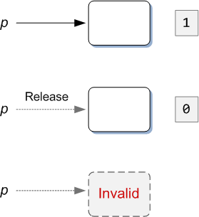
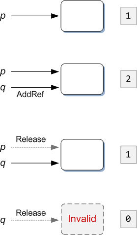

# Managing the Lifetime of an Object

There is a rule for COM interfaces that we have not yet mentioned. Every COM interface must inherit, directly or indirectly, from an interface named [**IUnknown**](/windows/desktop/api/unknwn/nn-unknwn-iunknown). This interface provides some baseline capabilities that all COM objects must support.

The [**IUnknown**](/windows/desktop/api/unknwn/nn-unknwn-iunknown) interface defines three methods:

-   [**QueryInterface**](/windows/desktop/api/unknwn/nf-unknwn-iunknown-queryinterface(q))
-   [**AddRef**](/windows/desktop/api/unknwn/nf-unknwn-iunknown-addref)
-   [**Release**](/windows/desktop/api/unknwn/nf-unknwn-iunknown-release)

The [**QueryInterface**](/windows/desktop/api/unknwn/nf-unknwn-iunknown-queryinterface(q)) method enables a program to query the capabilities of the object at run time. We'll say more about that in the next topic, [Asking an Object for an Interface](asking-an-object-for-an-interface.md). The [**AddRef**](/windows/desktop/api/unknwn/nf-unknwn-iunknown-addref) and [**Release**](/windows/desktop/api/unknwn/nf-unknwn-iunknown-release) methods are used to control the lifetime of an object. This is the subject of this topic.

## Reference Counting

Whatever else a program might do, at some point it will allocate and free resources. Allocating a resource is easy. Knowing when to free the resource is hard, especially if the lifetime of the resource extends beyond the current scope. This problem is not unique to COM. Any program that allocates heap memory must solve the same problem. For example, C++ uses automatic destructors, while C# and Java use garbage collection. COM uses an approach called *reference counting*.

Every COM object maintains an internal count. This is known as the reference count. The reference count tracks how many references to the object are currently active. When the number of references drops to zero, the object deletes itself. The last part is worth repeating: The object deletes itself. The program never explicitly deletes the object.

Here are the rules for reference counting:

-   When the object is first created, its reference count is 1. At this point, the program has a single pointer to the object.
-   The program can create a new reference by duplicating (copying) the pointer. When you copy the pointer, you must call the [**AddRef**](/windows/desktop/api/unknwn/nf-unknwn-iunknown-addref) method of the object. This method increments the reference count by one.
-   When you are finished using a pointer to the object, you must call [**Release**](/windows/desktop/api/unknwn/nf-unknwn-iunknown-release). The **Release** method decrements the reference count by one. It also invalidates the pointer. Do not use the pointer again after you call **Release**. (If you have other pointers to the same object, you can continue to use those pointers.)
-   When you have called [**Release**](/windows/desktop/api/unknwn/nf-unknwn-iunknown-release) with every pointer, the object reference count of the object reaches zero, and the object deletes itself.

The following diagram shows a simple but typical case.



The program creates an object and stores a pointer (*p*) to the object. At this point, the reference count is 1. When the program is finished using the pointer, it calls [**Release**](/windows/desktop/api/unknwn/nf-unknwn-iunknown-release). The reference count is decremented to zero, and the object deletes itself. Now *p* is invalid. It is an error to use *p* for any further method calls.

The next diagram shows a more complex example.



Here, the program creates an object and stores the pointer *p*, as before. Next, the program copies *p* to a new variable, *q*. At this point, the program must call [**AddRef**](/windows/desktop/api/unknwn/nf-unknwn-iunknown-addref) to increment the reference count. The reference count is now 2, and there are two valid pointers to the object. Now suppose that the program is finished using *p*. The program calls [**Release**](/windows/desktop/api/unknwn/nf-unknwn-iunknown-release), the reference count goes to 1, and *p* is no longer valid. However, *q* is still valid. Later, the program finishes using *q*. Therefore, it calls **Release** again. The reference count goes to zero, and the object deletes itself.

You might wonder why the program would copy *p*. There are two main reasons: First, you might want to store the pointer in a data structure, such as a list. Second, you might want to keep the pointer beyond the current scope of the original variable. Therefore, you would copy it to a new variable with wider scope.

One advantage of reference counting is that you can share pointers across different sections of code, without the various code paths coordinating to delete the object. Instead, each code path merely calls [**Release**](/windows/desktop/api/unknwn/nf-unknwn-iunknown-release) when that code path is done using the object. The object handles deleting itself at the correct time.

## Example

Here is the code from the [Open dialog box example](example--the-open-dialog-box.md) again.

```C++
HRESULT hr = CoInitializeEx(NULL, COINIT_APARTMENTTHREADED |
    COINIT_DISABLE_OLE1DDE);

if (SUCCEEDED(hr))
{
    IFileOpenDialog *pFileOpen;

    hr = CoCreateInstance(CLSID_FileOpenDialog, NULL, CLSCTX_ALL,
            IID_IFileOpenDialog, reinterpret_cast<void**>(&pFileOpen));

    if (SUCCEEDED(hr))
    {
        hr = pFileOpen->Show(NULL);
        if (SUCCEEDED(hr))
        {
            IShellItem *pItem;
            hr = pFileOpen->GetResult(&pItem);
            if (SUCCEEDED(hr))
            {
                PWSTR pszFilePath;
                hr = pItem->GetDisplayName(SIGDN_FILESYSPATH, &pszFilePath);
                if (SUCCEEDED(hr))
                {
                    MessageBox(NULL, pszFilePath, L&quot;File Path&quot;, MB_OK);
                    CoTaskMemFree(pszFilePath);
                }
                pItem->Release();
            }
        }
        pFileOpen->Release();
    }
    CoUninitialize();
}
````

Reference counting occurs in two places in this code. First, if program successfully creates the Common Item Dialog object, it must call [**Release**](/windows/desktop/api/unknwn/nf-unknwn-iunknown-release) on the *pFileOpen* pointer.

```C++
hr = CoCreateInstance(CLSID_FileOpenDialog, NULL, CLSCTX_ALL, 
        IID_IFileOpenDialog, reinterpret_cast<void**>(&pFileOpen));

if (SUCCEEDED(hr))
{
    // ...
    pFileOpen->Release();
}
```

Second, when the [**GetResult**](/windows/desktop/api/shobjidl_core/nf-shobjidl_core-ifiledialog-getresult) method returns a pointer to the [**IShellItem**](/windows/desktop/api/shobjidl_core/nn-shobjidl_core-ishellitem) interface, the program must call [**Release**](/windows/desktop/api/unknwn/nf-unknwn-iunknown-release) on the *pItem* pointer.

```C++
hr = pFileOpen->GetResult(&pItem);

if (SUCCEEDED(hr))
{
    // ...
    pItem->Release();
}
```

Notice that in both cases, the [**Release**](/windows/desktop/api/unknwn/nf-unknwn-iunknown-release) call is the last thing that happens before the pointer goes out of scope. Also notice that **Release** is called only after you test the **HRESULT** for success. For example, if the call to [**CoCreateInstance**](/windows/desktop/api/combaseapi/nf-combaseapi-cocreateinstance) fails, the *pFileOpen* pointer is not valid. Therefore, it would be an error to call **Release** on the pointer.

## Next

[Asking an Object for an Interface](asking-an-object-for-an-interface.md)