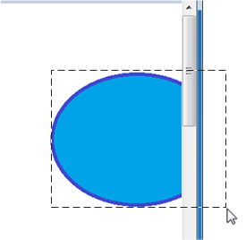
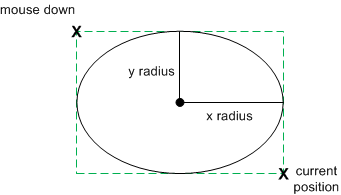

# Mouse movement

When the mouse moves, Windows posts a [**WM\_MOUSEMOVE**](/windows/win32/inputdev/wm-mousemove) message. By default, **WM\_MOUSEMOVE** goes to the window that contains the cursor. You can override this behavior by *capturing* the mouse, which is described in the next section.

The [**WM\_MOUSEMOVE**](/windows/win32/inputdev/wm-mousemove) message contains the same parameters as the messages for mouse clicks. The lowest 16 bits of *lParam* contain the x-coordinate, and the next 16 bits contain the y-coordinate. Use the [**GET\_X\_LPARAM**](/windows/win32/api/windowsx/nf-windowsx-get_x_lparam) and [**GET\_Y\_LPARAM**](/windows/win32/api/windowsx/nf-windowsx-get_y_lparam) macros to unpack the coordinates from *lParam*. The *wParam* parameter contains a bitwise **OR** of flags, indicating the state of the other mouse buttons plus the SHIFT and CTRL keys. The following code gets the mouse coordinates from *lParam*.

```cpp
int xPos = GET_X_LPARAM(lParam); 
int yPos = GET_Y_LPARAM(lParam);
```

Remember that these coordinates are in pixels, not device-independent pixels (DIPs). Later in this topic, we will look at code that converts between the two units.

A window can also receive a [**WM\_MOUSEMOVE**](/windows/win32/inputdev/wm-mousemove) message if the position of the cursor changes relative to the window. For example, if the cursor is positioned over a window, and the user hides the window, the window receives **WM\_MOUSEMOVE** messages even if the mouse did not move. One consequence of this behavior is that the mouse coordinates might not change between **WM\_MOUSEMOVE** messages.

## Capturing mouse movement outside the window

By default, a window stops receiving [**WM\_MOUSEMOVE**](/windows/win32/inputdev/wm-mousemove) messages if the mouse moves past the edge of the client area. But for some operations, you might need to track the mouse position beyond this point. For example, a drawing program might enable the user to drag the selection rectangle beyond the edge of the window, as shown in the following diagram.



To receive mouse-move messages past the edge of the window, call the [**SetCapture**](/windows/win32/api/winuser/nf-winuser-setcapture) function. After this function is called, the window will continue to receive [**WM\_MOUSEMOVE**](/windows/win32/inputdev/wm-mousemove) messages for as long as the user holds at least one mouse button down, even if the mouse moves outside the window. The capture window must be the foreground window, and only one window can be the capture window at a time. To release mouse capture, call the [**ReleaseCapture**](/windows/win32/api/winuser/nf-winuser-releasecapture) function.

You would typically use [**SetCapture**](/windows/win32/api/winuser/nf-winuser-setcapture) and [**ReleaseCapture**](/windows/win32/api/winuser/nf-winuser-releasecapture) in the following way.

1.  When the user presses the left mouse button, call [**SetCapture**](/windows/win32/api/winuser/nf-winuser-setcapture) to start capturing the mouse.
2.  Respond to mouse-move messages.
3.  When the user releases the left mouse button, call [**ReleaseCapture**](/windows/win32/api/winuser/nf-winuser-releasecapture).

## Example: drawing circles

Let's extend the Circle program from [Module 3](module-3---windows-graphics.md) by enabling the user to draw a circle with the mouse. Start with the [Direct2D Circle Sample](direct2d-circle-sample.md) program. We will modify the code in this sample to add simple drawing. First, add a new member variable to the `MainWindow` class.

```cpp
D2D1_POINT_2F ptMouse;
```

This variable stores the mouse-down position while the user is dragging the mouse. In the `MainWindow` constructor, initialize the *ellipse* and *ptMouse* variables.

```cpp
    MainWindow() : pFactory(NULL), pRenderTarget(NULL), pBrush(NULL),
        ellipse(D2D1::Ellipse(D2D1::Point2F(), 0, 0)),
        ptMouse(D2D1::Point2F())
    {
    }
```

Remove the body of the `MainWindow::CalculateLayout` method; it's not required for this example.

```cpp
void CalculateLayout() { }
```

Next, declare message handlers for the left-button down, left-button up, and mouse-move messages.

```cpp
void OnLButtonDown(int pixelX, int pixelY, DWORD flags);
void OnLButtonUp();
void OnMouseMove(int pixelX, int pixelY, DWORD flags);
```

Mouse coordinates are given in physical pixels, but Direct2D expects device-independent pixels (DIPs). To handle high-DPI settings correctly, you must translate the pixel coordinates into DIPs. For more discussion about DPI, see [DPI and Device-Independent Pixels](dpi-and-device-independent-pixels.md). The following code shows a helper class that converts pixels into DIPs.

```cpp
class DPIScale
{
    static float scale;

public:
    static void Initialize(HWND hwnd)
    {
        float dpi = GetDpiForWindow(hwnd);
        scale = dpi/96.0f;
    }

    template <typename T>
    static D2D1_POINT_2F PixelsToDips(T x, T y)
    {
        return D2D1::Point2F(static_cast<float>(x) / scale, static_cast<float>(y) / scale);
    }
};

float DPIScale::scale = 1.0f;
```

Call **DPIScale::Initialize** in your [**WM_CREATE**](/windows/win32/winmsg/wm-create) handler, after you create the Direct2D factory object.

```cpp
case WM_CREATE:
    if (FAILED(D2D1CreateFactory(D2D1_FACTORY_TYPE_SINGLE_THREADED, &pFactory)))
    {
        return -1;  // Fail CreateWindowEx.
    }
    DPIScale::Initialize(hwnd);
    return 0;
```

To get the mouse coordinates in DIPs from the mouse messages, do the following:

1.  Use the [**GET\_X\_LPARAM**](/windows/win32/api/windowsx/nf-windowsx-get_x_lparam) and [**GET\_Y\_LPARAM**](/windows/win32/api/windowsx/nf-windowsx-get_y_lparam) macros to get the pixel coordinates. These macros are defined in WindowsX.h, so remember to include that header in your project.
2.  Call `DPIScale::PixelsToDips` to convert pixels to DIPs.

Now add the message handlers to your window procedure.

```cpp
case WM_LBUTTONDOWN: 
    OnLButtonDown(GET_X_LPARAM(lParam), GET_Y_LPARAM(lParam), (DWORD)wParam);
    return 0;

case WM_LBUTTONUP: 
    OnLButtonUp();
    return 0;

case WM_MOUSEMOVE: 
    OnMouseMove(GET_X_LPARAM(lParam), GET_Y_LPARAM(lParam), (DWORD)wParam);
    return 0;
```

Finally, implement the message handlers themselves.

### Left button down

For the left-button down message, do the following:

1.  Call [**SetCapture**](/windows/win32/api/winuser/nf-winuser-setcapture) to begin capturing the mouse.
2.  Store the position of the mouse click in the *ptMouse* variable. This position defines the upper left corner of the bounding box for the ellipse.
3.  Reset the ellipse structure.
4.  Call [**InvalidateRect**](/windows/win32/api/winuser/nf-winuser-invalidaterect). This function forces the window to be repainted.

```cpp
void MainWindow::OnLButtonDown(int pixelX, int pixelY, DWORD flags)
{
    SetCapture(m_hwnd);
    ellipse.point = ptMouse = DPIScale::PixelsToDips(pixelX, pixelY);
    ellipse.radiusX = ellipse.radiusY = 1.0f; 
    InvalidateRect(m_hwnd, NULL, FALSE);
}
```

### Mouse move

For the mouse-move message, check whether the left mouse button is down. If it is, recalculate the ellipse and repaint the window. In Direct2D, an ellipse is defined by the center point and x- and y-radii. We want to draw an ellipse that fits the bounding box defined by the mouse-down point (*ptMouse*) and the current cursor position (*x*, *y*), so a bit of arithmetic is needed to find the width, height, and position of the ellipse.

The following code recalculates the ellipse and then calls [**InvalidateRect**](/windows/win32/api/winuser/nf-winuser-invalidaterect) to repaint the window.



```cpp
void MainWindow::OnMouseMove(int pixelX, int pixelY, DWORD flags)
{
    if (flags & MK_LBUTTON) 
    { 
        const D2D1_POINT_2F dips = DPIScale::PixelsToDips(pixelX, pixelY);

        const float width = (dips.x - ptMouse.x) / 2;
        const float height = (dips.y - ptMouse.y) / 2;
        const float x1 = ptMouse.x + width;
        const float y1 = ptMouse.y + height;

        ellipse = D2D1::Ellipse(D2D1::Point2F(x1, y1), width, height);

        InvalidateRect(m_hwnd, NULL, FALSE);
    }
}
```

### Left button up

For the left-button-up message, simply call [**ReleaseCapture**](/windows/win32/api/winuser/nf-winuser-releasecapture) to release the mouse capture.

```cpp
void MainWindow::OnLButtonUp()
{
    ReleaseCapture(); 
}
```

## Next

* [Other Mouse Operations](other-mouse-operations.md)
