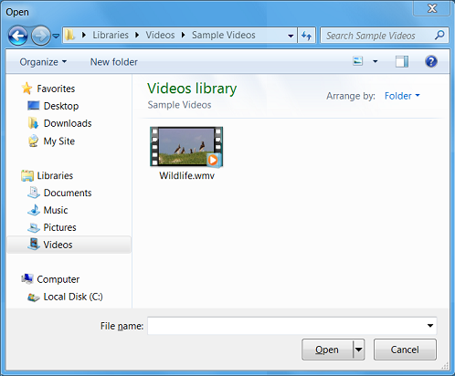

# Open Dialog Box Sample

This sample application shows how to initialize the Component Object Model (COM) library and use a COM-based API in a Windows program.

## Description

The Open Dialog Box sample application displays the **Open** dialog box, as shown in the screen shot that follows. The sample demonstrates how to call a COM object in a Windows program. This sample is discussed in [Module 2: Using COM in Your Windows Program](module-2--using-com-in-your-windows-program.md).

## Downloading the Sample

This sample is available [here](https://github.com/microsoft/Windows-classic-samples/tree/master/Samples/Win7Samples/begin/LearnWin32/OpenDialogBox).

## Related topics

* [Example: The Open Dialog Box](example--the-open-dialog-box.md)
* [Learn to Program for Windows: Sample Code](learn-to-program-for-windows--sample-code.md)
* [Module 2: Using COM in Your Windows Program](module-2--using-com-in-your-windows-program.md)
