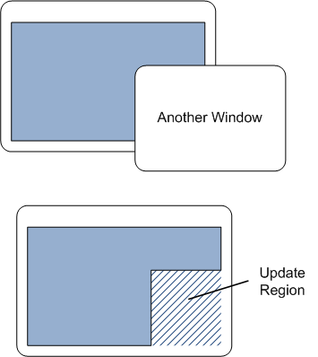
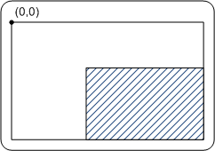

# Painting the Window

You've created your window. Now you want to show something inside it. In Windows terminology, this is called painting the window. To mix metaphors, a window is a blank canvas, waiting for you to fill it.

Sometimes your program will initiate painting to update the appearance of the window. At other times, the operating system will notify you that you must repaint a portion of the window. When this occurs, the operating system sends the window a [**WM\_PAINT**](https://msdn.microsoft.com/library/windows/desktop/dd145213) message. The portion of the window that must be painted is called the *update region*.

The first time a window is shown, the entire client area of the window must be painted. Therefore, you will always receive at least one [**WM\_PAINT**](https://msdn.microsoft.com/library/windows/desktop/dd145213) message when you show a window.


You are only responsible for painting the client area. The surrounding frame, including the title bar, is automatically painted by the operating system. After you finish painting the client area, you clear the update region, which tells the operating system that it does not need to send another [**WM\_PAINT**](https://msdn.microsoft.com/library/windows/desktop/dd145213) message until something changes.

Now suppose the user moves another window so that it obscures a portion of your window. When the obscured portion becomes visible again, that portion is added to the update region, and your window receives another [**WM\_PAINT**](https://msdn.microsoft.com/library/windows/desktop/dd145213) message.



The update region also changes if the user stretches the window. In the following diagram, the user stretches the window to the right. The newly exposed area on the right side of the window is added to the update region:


In our first example program, the painting routine is very simple. It just fills the entire client area with a solid color. Still, this example is enough to demonstrate some of the important concepts.


```C++
    switch (uMsg)
    {
```

<span codelanguage="ManagedCPlusPlus"></span>

<table>
<colgroup>
<col style="width: 100%" />
</colgroup>
<thead>
<tr class="header">
<th>C++</th>
</tr>
</thead>
<tbody>
<tr class="odd">
<td><pre><code>    case WM_PAINT:
        {
            PAINTSTRUCT ps;
            HDC hdc = BeginPaint(hwnd, &amp;ps);

            // All painting occurs here, between BeginPaint and EndPaint.

            FillRect(hdc, &amp;ps.rcPaint, (HBRUSH) (COLOR_WINDOW+1));

            EndPaint(hwnd, &amp;ps);
        }
        return 0;
</code></pre></td>
</tr>
</tbody>
</table>

<span codelanguage="ManagedCPlusPlus"></span>

<table>
<colgroup>
<col style="width: 100%" />
</colgroup>
<thead>
<tr class="header">
<th>C++</th>
</tr>
</thead>
<tbody>
<tr class="odd">
<td><pre><code>    }</code></pre></td>
</tr>
</tbody>
</table>


Start the painting operation by calling the [**BeginPaint**](https://msdn.microsoft.com/library/windows/desktop/dd183362) function. This function fills in the [**PAINTSTRUCT**](https://msdn.microsoft.com/library/windows/desktop/dd162768) structure with information on the repaint request. The current update region is given in the **rcPaint** member of **PAINTSTRUCT**. This update region is defined relative to the client area:



In your painting code, you have two basic options:

-   Paint the entire client area, regardless of the size of the update region. Anything that falls outside of the update region is clipped. That is, the operating system ignores it.
-   Optimize by painting just the portion of the window inside the update region.

If you always paint the entire client area, the code will be simpler. If you have complicated painting logic, however, it can be more efficient to skip the areas outside of the update region.

The following line of code fills the update region with a single color, using the system-defined window background color (**COLOR\_WINDOW**). The actual color indicated by **COLOR\_WINDOW** depends on the user's current color scheme.


```C++
            FillRect(hdc, &amp;ps.rcPaint, (HBRUSH) (COLOR_WINDOW+1));
```


The details of [**FillRect**](https://msdn.microsoft.com/library/windows/desktop/dd162719) are not important for this example, but the second parameter gives the coordinates of the rectangle to fill. In this case, we pass in the entire update region (the **rcPaint** member of [**PAINTSTRUCT**](https://msdn.microsoft.com/library/windows/desktop/dd162768)). On the first [**WM\_PAINT**](https://msdn.microsoft.com/library/windows/desktop/dd145213) message, the entire client area needs to be painted, so **rcPaint** will contain the entire client area. On subsequent **WM\_PAINT** messages, **rcPaint** might contain a smaller rectangle.

The [**FillRect**](https://msdn.microsoft.com/library/windows/desktop/dd162719) function is part of the Graphics Device Interface (GDI), which has powered Windows graphics for a very long time. In Windows 7, Microsoft introduced a new graphics engine, named Direct2D, which supports high-performance graphics operations, such as hardware acceleration. Direct2D is also available for Windows Vista through the [Platform Update for Windows Vista](win7ip-platform_update_for_windows_vista_overview) and for Windows Server 2008 through the Platform Update for Windows Server 2008. (GDI is still fully supported.)

After you are done painting, call the [**EndPaint**](https://msdn.microsoft.com/library/windows/desktop/dd162598) function. This function clears the update region, which signals to Windows that the window has completed painting itself.

## Next

[Closing the Window](closing-the-window.md)

 

 


