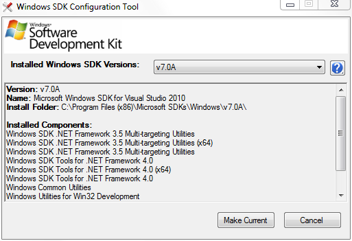

# Prepare Your Development Environment

## Install the Windows SDK

To write a Windows program in C or C++, you must install the Microsoft Windows Software Development Kit (SDK) or a development environment that includes the Windows SDK, such as Microsoft Visual C++. The Windows SDK contains the headers and libraries necessary to compile and link your application. The Windows SDK also contains command-line tools for building Windows applications, including the Visual C++ compiler and linker. Although you can compile and build Windows programs with the command-line tools, we recommend using a full-featured development environment such as Microsoft Visual Studio. Microsoft Visual C++ Express is a free downloadable edition of Visual C++ available at <http://go.microsoft.com/fwlink/p/?linkid=181514>.

Each release of the Windows SDK targets the latest version of Windows as well as several previous versions. The release notes list the specific platforms that are supported, but unless you are maintaining an application for a very old version of Windows, you should install the latest release of the Windows SDK. You can download the latest Windows SDK from <http://go.microsoft.com/fwlink/p/?linkid=129787>.

The Windows SDK supports development of both 32-bit and 64-bit applications. In fact, the Windows APIs are designed so that the same code can compile for 32-bit or 64-bit without changes.

> [!Note]  
> The Windows SDK does not support hardware driver development, and this series will not discuss driver development. For information about writing a hardware driver, see [Getting Started with Windows Drivers](http://go.microsoft.com/fwlink/p/?linkid=181442).

 

## Set Include and Library Paths

After you install the Windows SDK, make sure that your development environment points to the Include and Lib folders, which contain the header and library files.

For Visual Studio, the Windows SDK includes a Visual Studio Configuration Tool. This tool updates Visual Studio to use the Windows SDK header and library paths. For more information about this tool, see the Windows SDK release notes (<http://go.microsoft.com/fwlink/p/?linkid=182068>). Alternatively, you can add the paths from Visual Studio. For more information, consult the Visual Studio help documentation.

If you are interested in using Microsoft Visual C++ 2010 Express, you can find more detailed setup instructions in Chapter 2 of the "Hilo" project, [Setting up the Hilo Development Environment]( http://go.microsoft.com/fwlink/p/?linkid=195538).

## Next

[Windows Coding Conventions](windows-coding-conventions.md)

## Related topics

<dl> <dt>

[Windows SDK](http://go.microsoft.com/fwlink/p/?linkid=129787)
</dt> </dl>

 

 

