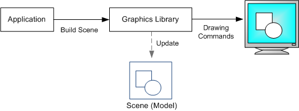
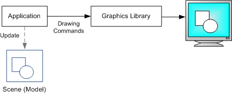

# Retained Mode Versus Immediate Mode

Graphics APIs can be divided into *retained-mode* APIs and *immediate-mode* APIs. Direct2D is an immediate-mode API. Windows Presentation Foundation (WPF) is an example of a retained-mode API.

A retained-mode API is declarative. The application constructs a scene from graphics primitives, such as shapes and lines. The graphics library stores a model of the scene in memory. To draw a frame, the graphics library transforms the scene into a set of drawing commands. Between frames, the graphics library keeps the scene in memory. To change what is rendered, the application issues a command to update the scene—for example, to add or remove a shape. The library is then responsible for redrawing the scene.

An immediate-mode API is procedural. Each time a new frame is drawn, the application directly issues the drawing commands. The graphics library does not store a scene model between frames. Instead, the application keeps track of the scene.

Retained-mode APIs can be simpler to use, because the API does more of the work for you, such as initialization, state maintenance, and cleanup. On the other hand, they are often less flexible, because the API imposes its own scene model. Also, a retained-mode API can have higher memory requirements, because it needs to provide a general-purpose scene model. With an immediate-mode API, you can implement targeted optimizations.

## Next

[Your First Direct2D Program](your-first-direct2d-program.md)

 

 

