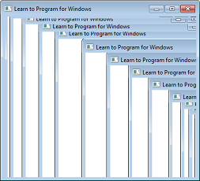
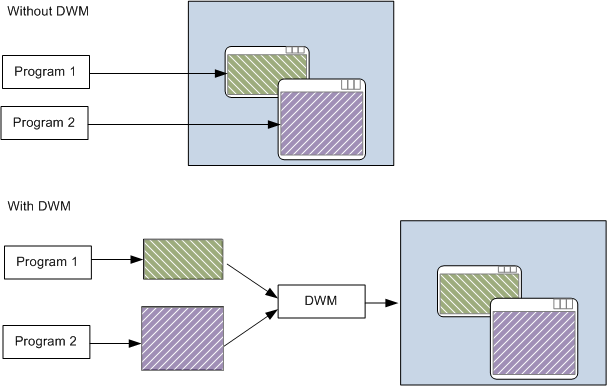

# The Desktop Window Manager

Before Windows Vista, a Windows program would draw directly to the screen. In other words, the program would write directly to the memory buffer shown by the video card. This approach can cause visual artifacts if a window does not repaint itself correctly. For example, if the user drags one window over another window, and the window underneath does not repaint itself quickly enough, the top-most window can leave a trail:

The trail is caused because both windows paint to the same area of memory. As the top-most window is dragged, the window below it must be repainted. If the repainting is too slow, it causes the artifacts shown in the previous image.

Windows Vista fundamentally changed how windows are drawn, by introducing the Desktop Window Manager (DWM). When the DWM is enabled, a window no longer draws directly to the display buffer. Instead, each window draws to an offscreen memory buffer, also called an *offscreen surface*. The DWM then composites these surfaces to the screen.

The DWM provides several advantages over the old graphics architecture.

-   Fewer repaint messages. When a window is obstructed by another window, the obstructed window does not need to repaint itself.
-   Reduced artifacts. Previously, dragging a window could create visual artifacts, as described.
-   Visual effects. Because the DWM is in charge of compositing the screen, it can render translucent and blurred areas of the window.
-   Automatic scaling for high DPI. Although scaling is not the ideal way to handle high DPI, it is a viable fallback for older applications that were not designed for high DPI settings. (We will return to this topic later, in the section [DPI and Device-Independent Pixels](dpi-and-device-independent-pixels.md).)
-   Alternative views. The DWM can use the offscreen surfaces in various interesting ways. For example, the DWM is the technology behind Windows Flip 3D, thumbnails, and animated transitions.

Note, however, that the DWM is not guaranteed to be enabled. The graphics card might not support the DWM system requirements, and users can disable the DWM through the **System Properties** control panel. That means your program should not rely on the repainting behavior of the DWM. Test your program with DWM disabled to make sure that it repaints correctly.

## Next

[Retained Mode Versus Immediate Mode](retained-mode-versus-immediate-mode.md)

 

 

