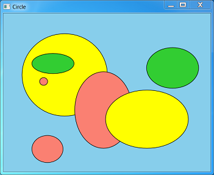

# User input: extended example

Let's combine everything that we have learned about user input to create a simple drawing program. Here is a screen shot of the program:



The user can draw ellipses in several different colors, and select, move, or delete ellipses. To keep the UI simple, the program does not let the user select the ellipse colors. Instead, the program automatically cycles through a predefined list of colors. The program does not support any shapes other than ellipses. Obviously, this program will not win any awards for graphics software. However, it is still a useful example to learn from. You can download the complete source code from [Simple Drawing Sample](simple-drawing-sample.md). This section will just cover some highlights.

Ellipses are represented in the program by a structure that contains the ellipse data ([**D2D1\_ELLIPSE**](/windows/desktop/api/d2d1/ns-d2d1-d2d1_ellipse)) and the color ([**D2D1\_COLOR\_F**](/windows/desktop/Direct2D/d2d1-color-f)). The structure also defines two methods: a method to draw the ellipse, and a method to perform hit testing.

```C++
struct MyEllipse
{
    D2D1_ELLIPSE    ellipse;
    D2D1_COLOR_F    color;

    void Draw(ID2D1RenderTarget *pRT, ID2D1SolidColorBrush *pBrush)
    {
        pBrush->SetColor(color);
        pRT->FillEllipse(ellipse, pBrush);
        pBrush->SetColor(D2D1::ColorF(D2D1::ColorF::Black));
        pRT->DrawEllipse(ellipse, pBrush, 1.0f);
    }

    BOOL HitTest(float x, float y)
    {
        const float a = ellipse.radiusX;
        const float b = ellipse.radiusY;
        const float x1 = x - ellipse.point.x;
        const float y1 = y - ellipse.point.y;
        const float d = ((x1 * x1) / (a * a)) + ((y1 * y1) / (b * b));
        return d <= 1.0f;
    }
};
```


The program uses the same solid-color brush to draw the fill and outline for every ellipse, changing the color as needed. In Direct2D, changing the color of a solid-color brush is an efficient operation. So, the solid-color brush object supports a [**SetColor**](/windows/desktop/Direct2D/id2d1solidcolorbrush-setcolor) method.

The ellipses are stored in an STL **list** container:


```C++
    list<shared_ptr<MyEllipse>>             ellipses;
```


> [!Note]  
> **shared\_ptr** is a smart-pointer class that was added to C++ in TR1 and formalized in C++0x. Visual Studio 2010 adds support for **shared\_pt**r and other C++0x features. For more information, see [Exploring New C++ and MFC Features in Visual Studio 2010](/archive/msdn-magazine/2010/april/visual-c-exploring-new-c-and-mfc-features-in-visual-studio-2010) in *MSDN Magazine*. (This resource may not be available in some languages and countries.)

 

The program has three modes:

-   Draw mode. The user can draw new ellipses.
-   Selection mode. The user can select an ellipse.
-   Drag mode. The user can drag a selected ellipse.

The user can switch between draw mode and selection mode by using the same keyboard shortcuts described in [Accelerator Tables](accelerator-tables.md). From selection mode, the program switches to drag mode if the user clicks on an ellipse. It switches back to selection mode when the user releases the mouse button. The current selection is stored as an iterator into the list of ellipses. The helper method `MainWindow::Selection` returns a pointer to the selected ellipse, or the value **nullptr** if there is no selection.


```C++
    list<shared_ptr<MyEllipse>>::iterator   selection;
     
    shared_ptr<MyEllipse> Selection() 
    { 
        if (selection == ellipses.end()) 
        { 
            return nullptr;
        }
        else
        {
            return (*selection);
        }
    }

    void    ClearSelection() { selection = ellipses.end(); }
```


The following table summarizes the effects of mouse input in each of the three modes.


| Mouse Input      | Draw Mode                                          | Selection Mode                                                                                                                               | Drag Mode                  |
|------------------|----------------------------------------------------|----------------------------------------------------------------------------------------------------------------------------------------------|----------------------------|
| Left button down | Set mouse capture and start to draw a new ellipse. | Release the current selection and perform a hit test. If an ellipse is hit, capture the cursor, select the ellipse, and switch to drag mode. | No action.                 |
| Mouse move       | If the left button is down, resize the ellipse.    | No action.                                                                                                                                   | Move the selected ellipse. |
| Left button up   | Stop drawing the ellipse.                          | No action.                                                                                                                                   | Switch to selection mode.  |


 

The following method in the `MainWindow` class handles [**WM\_LBUTTONDOWN**](/windows/desktop/inputdev/wm-lbuttondown) messages.


```C++
void MainWindow::OnLButtonDown(int pixelX, int pixelY, DWORD flags)
{
    const float dipX = DPIScale::PixelsToDipsX(pixelX);
    const float dipY = DPIScale::PixelsToDipsY(pixelY);

    if (mode == DrawMode)
    {
        POINT pt = { pixelX, pixelY };

        if (DragDetect(m_hwnd, pt))
        {
            SetCapture(m_hwnd);
        
            // Start a new ellipse.
            InsertEllipse(dipX, dipY);
        }
    }
    else
    {
        ClearSelection();

        if (HitTest(dipX, dipY))
        {
            SetCapture(m_hwnd);

            ptMouse = Selection()->ellipse.point;
            ptMouse.x -= dipX;
            ptMouse.y -= dipY;

            SetMode(DragMode);
        }
    }
    InvalidateRect(m_hwnd, NULL, FALSE);
}
```


Mouse coordinates are passed to this method in pixels, and then converted to DIPs. It is important not to confuse these two units. For example, the [**DragDetect**](/windows/desktop/api/winuser/nf-winuser-dragdetect) function uses pixels, but drawing and hit-testing use DIPs. The general rule is that functions related to windows or mouse input use pixels, while Direct2D and DirectWrite use DIPs. Always test your program at a high-DPI setting, and remember to mark your program as DPI-aware. For more information, see [DPI and Device-Independent Pixels](dpi-and-device-independent-pixels.md).

Here is the code that handles [**WM\_MOUSEMOVE**](/windows/desktop/inputdev/wm-mousemove) messages.


```C++
void MainWindow::OnMouseMove(int pixelX, int pixelY, DWORD flags)
{
    const float dipX = DPIScale::PixelsToDipsX(pixelX);
    const float dipY = DPIScale::PixelsToDipsY(pixelY);

    if ((flags & MK_LBUTTON) && Selection())
    { 
        if (mode == DrawMode)
        {
            // Resize the ellipse.
            const float width = (dipX - ptMouse.x) / 2;
            const float height = (dipY - ptMouse.y) / 2;
            const float x1 = ptMouse.x + width;
            const float y1 = ptMouse.y + height;

            Selection()->ellipse = D2D1::Ellipse(D2D1::Point2F(x1, y1), width, height);
        }
        else if (mode == DragMode)
        {
            // Move the ellipse.
            Selection()->ellipse.point.x = dipX + ptMouse.x;
            Selection()->ellipse.point.y = dipY + ptMouse.y;
        }
        InvalidateRect(m_hwnd, NULL, FALSE);
    }
}
```


The logic to resize an ellipse was described previously, in the section [Example: Drawing Circles](mouse-movement.md). Also note the call to [**InvalidateRect**](/windows/desktop/api/winuser/nf-winuser-invalidaterect). This makes sure that the window is repainted. The following code handles [**WM\_LBUTTONUP**](/windows/desktop/inputdev/wm-lbuttonup) messages.


```C++
void MainWindow::OnLButtonUp()
{
    if ((mode == DrawMode) && Selection())
    {
        ClearSelection();
        InvalidateRect(m_hwnd, NULL, FALSE);
    }
    else if (mode == DragMode)
    {
        SetMode(SelectMode);
    }
    ReleaseCapture(); 
}
```


As you can see, the message handlers for mouse input all have branching code, depending on the current mode. That is an acceptable design for this fairly simple program. However, it could quickly become too complex if new modes are added. For a larger program, a model-view-controller (MVC) architecture might be a better design. In this kind of architecture, the *controller*, which handles user input, is separated from the *model*, which manages application data.

When the program switches modes, the cursor changes to give feedback to the user.


```C++
void MainWindow::SetMode(Mode m)
{
    mode = m;

    // Update the cursor
    LPWSTR cursor;
    switch (mode)
    {
    case DrawMode:
        cursor = IDC_CROSS;
        break;

    case SelectMode:
        cursor = IDC_HAND;
        break;

    case DragMode:
        cursor = IDC_SIZEALL;
        break;
    }

    hCursor = LoadCursor(NULL, cursor);
    SetCursor(hCursor);
}
```


And finally, remember to set the cursor when the window receives a [**WM\_SETCURSOR**](/windows/desktop/menurc/wm-setcursor) message:


```C++
    case WM_SETCURSOR:
        if (LOWORD(lParam) == HTCLIENT)
        {
            SetCursor(hCursor);
            return TRUE;
        }
        break;
```


## Summary

In this module, you learned how to handle mouse and keyboard input; how to define keyboard shortcuts; and how to update the cursor image to reflect the current state of the program.

 

 
