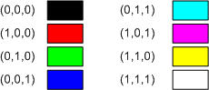
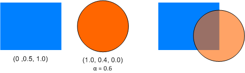
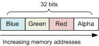

# Using Color in Direct2D

Direct2D uses the RGB color model, in which colors are formed by combining different values of red, green, and blue. A fourth component, alpha, measures the transparency of a pixel. In Direct2D, each of these components is a floating-point value with a range of \[0.0 1.0\]. For the three color components, the value measures the intensity of the color. For the alpha component, 0.0 means completely transparent, and 1.0 means completely opaque. The following table shows the colors that result from various combinations of 100% intensity.


| Red | Green | Blue | Color   |
|-----|-------|------|---------|
| 0   | 0     | 0    | Black   |
| 1   | 0     | 0    | Red     |
| 0   | 1     | 0    | Green   |
| 0   | 0     | 1    | Blue    |
| 0   | 1     | 1    | Cyan    |
| 1   | 0     | 1    | Magenta |
| 1   | 1     | 0    | Yellow  |
| 1   | 1     | 1    | White   |


 



Color values between 0 and 1 result in different shades of these pure colors. Direct2D uses the [**D2D1\_COLOR\_F**](/windows/desktop/Direct2D/d2d1-color-f) structure to represent colors. For example, the following code specifies magenta.


```C++
    // Initialize a magenta color.

    D2D1_COLOR_F clr;
    clr.r = 1;
    clr.g = 0;
    clr.b = 1;
    clr.a = 1;  // Opaque.
```


You can also specify a color using the [**D2D1::ColorF**](/windows/desktop/api/d2d1helper/nl-d2d1helper-colorf) class, which derives from the [**D2D1\_COLOR\_F**](/windows/desktop/Direct2D/d2d1-color-f) structure.


```C++
    // Equivalent to the previous example.

    D2D1::ColorF clr(1, 0, 1, 1);
```


## Alpha Blending

Alpha blending creates translucent areas by blending the foreground color with the background color, using the following formula.

<dl> color = af * Cf + (1 - af) * Cb  
</dl>

where *Cb* is the background color, *Cf* is the foreground color, and *af* is the alpha value of the foreground color. This formula is applied pairwise to each color component. For example, suppose the foreground color is **(R = 1.0, G = 0.4, B = 0.0)**, with **alpha = 0.6**, and the background color is **(R = 0.0, G = 0.5, B = 1.0)**. The resulting alpha-blended color is:

R = (1.0 * 0.6 + 0 * 0.4) = .6   
G = (0.4 * 0.6 + 0.5 * 0.4) = .44  
B = (0 * 0.6 + 1.0 * 0.4) = .40  

The following image shows the result of this blending operation.



## Pixel Formats

The [**D2D1\_COLOR\_F**](/windows/desktop/Direct2D/d2d1-color-f) structure does not describe how a pixel is represented in memory. In most cases, that doesn't matter. Direct2D handles all of the internal details of translating color information into pixels. But you might need to know the pixel format if you are working directly with a bitmap in memory, or if you combine Direct2D with Direct3D or GDI.

The [**DXGI\_FORMAT**](/windows/desktop/api/dxgiformat/ne-dxgiformat-dxgi_format) enumeration defines a list of pixel formats. The list is fairly long, but only a few of them are relevant to Direct2D. (The others are used by Direct3D).


| Pixel format                                                                                                                           | Description                                                                                                                                                                                                                                                       |
|----------------------------------------------------------------------------------------------------------------------------------------|-------------------------------------------------------------------------------------------------------------------------------------------------------------------------------------------------------------------------------------------------------------------|
| <span id="DXGI_FORMAT_B8G8R8A8_UNORM"></span><span id="dxgi_format_b8g8r8a8_unorm"></span>**DXGI\_FORMAT\_B8G8R8A8\_UNORM**<br/> | This is the most common pixel format. All pixel components (red, green, blue, and alpha) are 8-bit unsigned integers. The components are arranged in *BGRA* order in memory. (See illustration that follows.)<br/>                                          |
| <span id="DXGI_FORMAT_R8G8B8A8_UNORM"></span><span id="dxgi_format_r8g8b8a8_unorm"></span>**DXGI\_FORMAT\_R8G8B8A8\_UNORM**<br/> | Pixel components are 8-bit unsigned integers, in *RGBA* order. In other words, the red and blue components are swapped, relative to **DXGI\_FORMAT\_B8G8R8A8\_UNORM**. This format is supported only for hardware devices.<br/>                             |
| <span id="DXGI_FORMAT_A8_UNORM"></span><span id="dxgi_format_a8_unorm"></span>**DXGI\_FORMAT\_A8\_UNORM**<br/>                   | This format contains an 8-bit alpha component, with no RGB components. It is useful for creating opacity masks. To read more about using opacity masks in Direct2D, see [Compatible A8 Render Targets Overview](/windows/desktop/Direct2D/compatible-a8-rendertargets).<br/> |


 

The following illustration shows BGRA pixel layout.



To get the pixel format of a render target, call [**ID2D1RenderTarget::GetPixelFormat**](/windows/desktop/api/d2d1/nf-d2d1-id2d1rendertarget-getpixelformat). The pixel format might not match the display resolution. For example, the display might be set to 16-bit color, even though the render target uses 32-bit color.

### Alpha Mode

A render target also has an alpha mode, which defines how the alpha values are treated.


| Alpha mode                           | Desciption                                                                                                                                                                                                                                                                                                                         |
|--------------------------------------|------------------------------------------------------------------------------------------------------------------------------------------------------------------------------------------------------------------------------------------------------------------------------------------------------------------------------------|
| **D2D1\_ALPHA\_MODE\_IGNORE**        | No alpha blending is performed. Alpha values are ignored.                                                                                                                                                                                                                                                                          |
| **D2D1\_ALPHA\_MODE\_STRAIGHT**      | Straight alpha. The color components of the pixel represent the color intensity prior to alpha blending.                                                                                                                                                                                                                           |
| **D2D1\_ALPHA\_MODE\_PREMULTIPLIED** | Premultiplied alpha. The color components of the pixel represent the color intensity multiplied by the alpha value. This format is more efficient to render than straight alpha, because the term (af   Cf) from the alpha-blending formula is pre-computed. However, this format is not appropriate for storing in an image file. |


 

Here is an example of the difference between straight alpha and premultiplied alpha. Suppose the desired color is pure red (100% intensity) with 50% alpha. As a Direct2D type, this color would be represented as (1, 0, 0, 0.5). Using straight alpha, and assuming 8-bit color components, the red component of the pixel is 0xFF. Using premultiplied alpha, the red component is scaled by 50% to equal 0x80.

The [**D2D1\_COLOR\_F**](/windows/desktop/Direct2D/d2d1-color-f) data type always represents colors using straight alpha. Direct2D converts pixels to premultiplied alpha format if needed.

If you know that your program will not perform any alpha blending, create the render target with the **D2D1\_ALPHA\_MODE\_IGNORE** alpha mode. This mode can improve performance, because Direct2D can skip the alpha calculations. For more information, see [Improving the Performance of Direct2D Applications](/windows/desktop/Direct2D/improving-direct2d-performance).

## Next

[Applying Transforms in Direct2D](applying-transforms-in-direct2d.md)

 

