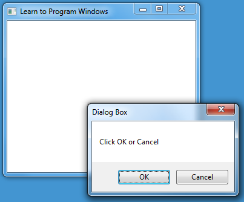
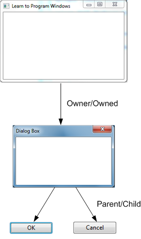
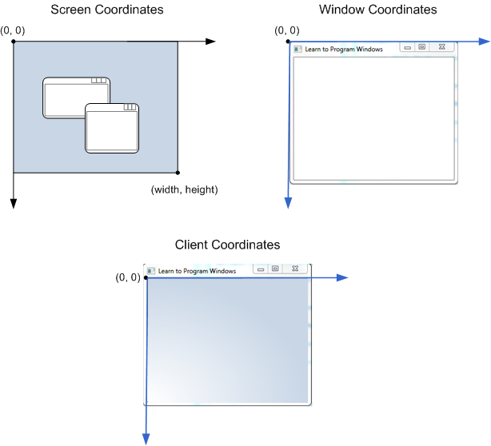

# What Is a Window?

## What Is a Window?

Obviously, windows are central to Windows. They are so important that they named the operating system after them. But what is a window? When you think of a window, you probably think of something like this:


This type of window is called an *application window* or *main window*. It typically has a frame with a title bar, **Minimize** and **Maximize** buttons, and other standard UI elements. The frame is called the *non-client area* of the window, so called because the operating system manages that portion of the window. The area within the frame is the *client area*. This is the part of the window that your program manages.

Here is another type of window:


If you are new to Windows programming, it may surprise you that UI controls, such as buttons and edit boxes, are themselves windows. The major difference between a UI control and an application window is that a control does not exist by itself. Instead, the control is positioned relative to the application window. When you drag the application window, the control moves with it, as you would expect. Also, the control and the application window can communicate with each other. (For example, the application window receives click notifications from a button.)

Therefore, when you think *window*, do not simply think *application window*. Instead, think of a window as a programming construct that:

-   Occupies a certain portion of the screen.
-   May or may not be visible at a given moment.
-   Knows how to draw itself.
-   Responds to events from the user or the operating system.

## Parent Windows and Owner Windows

In the case of a UI control, the control window is said to be the *child* of the application window. The application window is the *parent* of the control window. The parent window provides the coordinate system used for positioning a child window. Having a parent window affects aspects of a window's appearance; for example, a child window is clipped so that no part of the child window can appear outside the borders of its parent window.

Another relationship is the relation between an application window and a modal dialog window. When an application displays a modal dialog, the application window is the *owner* window, and the dialog is an *owned* window. An owned window always appears in front of its owner window. It is hidden when the owner is minimized, and is destroyed at the same time as the owner.

The following image shows an application that displays a dialog box with two buttons:



The application window owns the dialog window, and the dialog window is the parent of both button windows. The following diagram shows these relations:



## Window Handles

Windows are objects—they have both code and data—but they are not C++ classes. Instead, a program references a window by using a value called a *handle*. A handle is an opaque type. Essentially, it is just a number that the operating system uses to identify an object. You can picture Windows as having a big table of all the windows that have been created. It uses this table to look up windows by their handles. (Whether that's exactly how it works internally is not important.) The data type for window handles is **HWND**, which is usually pronounced "aitch-wind." Window handles are returned by the functions that create windows: [**CreateWindow**](/windows/desktop/DirectShow/cbasewindow-docreatewindow) and [**CreateWindowEx**](/windows/desktop/api/winuser/nf-winuser-createwindowexa).

To perform an operation on a window, you will typically call some function that takes an **HWND** value as a parameter. For example, to reposition a window on the screen, call the [**MoveWindow**](/windows/desktop/api/winuser/nf-winuser-movewindow) function:


```C++
BOOL MoveWindow(HWND hWnd, int X, int Y, int nWidth, int nHeight, BOOL bRepaint);
```


The first parameter is the handle to the window that you want to move. The other parameters specify the new location of the window and whether the window should be redrawn.

Keep in mind that handles are not pointers. If *hwnd* is a variable that contains a handle, attempting to dereference the handle by writing `*hwnd` is an error.

## Screen and Window Coordinates

Coordinates are measured in device-independent pixels. We'll have more to say about the *device independent* part of *device-independent pixels* when we discuss graphics.

Depending on your task, you might measure coordinates relative to the screen, relative to a window (including the frame), or relative to the client area of a window. For example, you would position a window on the screen using screen coordinates, but you would draw inside a window using client coordinates. In each case, the origin (0, 0) is always the top-left corner of the region.



## Next

[WinMain: The Application Entry Point](winmain--the-application-entry-point.md)

 

 
