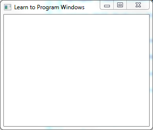

# Windows Hello World Sample

This sample application shows how to create a minimal Windows program.

## Description

The Windows Hello World sample application creates and shows an empty window, as shown in the screen shot that follows. This sample is discussed in [Module 1. Your First Windows Program](your-first-windows-program.md).

## Downloading the Sample

This sample is available [here](https://github.com/microsoft/Windows-classic-samples/tree/master/Samples/Win7Samples/begin/LearnWin32/HelloWorld).

To download it, go to the root of the sample repo on GitHub ([microsoft/Windows-classic-samples](https://github.com/microsoft/Windows-classic-samples/)) and click the **Clone or download** button to download the zip file of all the samples to your computer. Then unzip the folder.

To open the sample in Visual Studio, select **File / Open / Project/Solution**, and navigate to the location you unzipped the folder and **Windows-classic-samples-master / Samples / Win7Samples / begin / LearnWin32 / HelloWorld / cpp**. Open the file **HelloWorld.sln**.

Once the sample has loaded, you will need to update it to work with Windows 10. From the **Project** menu in Visual Studio, select **Properties**. Update the **Windows SDK Version** to a Windows 10 SDK, such as 10.0.17763.0 or better. Then change **Platform Toolset** to Visual Studio 2017 or better. Now you can run the sample by pressing F5!

## Related topics

* [Learn to Program for Windows: Sample Code](learn-to-program-for-windows--sample-code.md)
* [Module 1. Your First Windows Program](your-first-windows-program.md)
