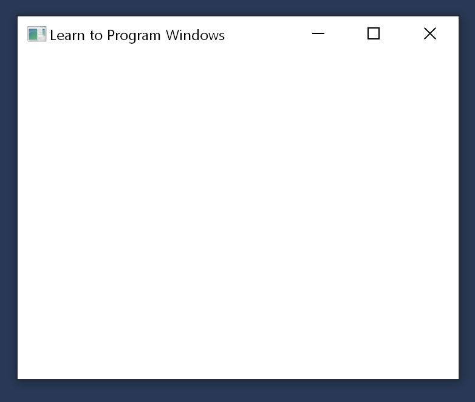

# Windows Hello World Sample

This sample application shows how to create a minimal Windows program.

## Description

The Windows Hello World sample application creates and shows an empty window, as shown in the screen shot that follows. This sample is discussed in [Module 1. Your First Windows Program](your-first-windows-program.md).

## Downloading the Sample

This sample is available in the MSDN Code Gallery at [http://go.microsoft.com/fwlink/p/?linkid=184824]( http://go.microsoft.com/fwlink/p/?linkid=184824).

## Related topics

<dl> <dt>

[Learn to Program for Windows: Sample Code](learn-to-program-for-windows--sample-code.md)
</dt> <dt>

[Module 1. Your First Windows Program](your-first-windows-program.md)
</dt> </dl>

 

 

