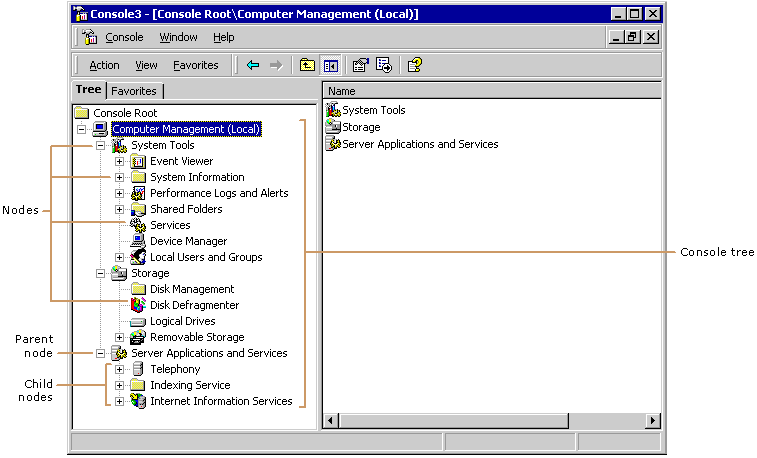

# How MMC 2.0 Manages Administration Problems

You can use Microsoft Management Console (MMC) to create, save, and open administrative tools (called MMC *consoles*) that manage the hardware, software, and network components of your Windows system.

MMC does not perform administrative functions, but hosts tools that do. The primary type of tool you can add to a console is called a snap-in. Other items that you can add include ActiveX controls, links to webpages, folders, taskpad views, and tasks.

It provides a multiple-document interface (MDI) in which each window is a *view*. Each view can contain one or more administrative components that supply the management behavior. Each administrative component is a *snap-in*.

The previous figure shows an MMC console that contains a tree structure in the left pane. Each branch of the tree is a *node*. The *console tree* contains a hierarchy of nodes. Each node is the *parent* of any nodes that lie one level below it in the tree hierarchy. The nodes below a parent node are *child* nodes.

By using snap-ins in MMC consoles, administrators no longer need to hunt for administration tools and the tools can have a common user interface. The guidelines provided in this documentation are critical for the creation of snap-ins with a common user interface. This lessens the administrator's learning and training curve.

 

 

