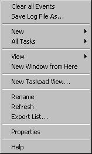
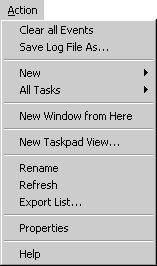

# Menus

The menus for a snap-in follow the standard Windows conventions, as specified in the Microsoft Windows User Experience book. A snap-in creates the right-click context menu for an item, and MMC builds the corresponding console Action menu for that item. The context menu must include the View menu as a cascading menu item as shown in the following illustration.

Be aware that the only difference in these menus is the inclusion of the View cascading menu on the context menu. If the node is selected, the context menu and the Action menu are identical (except, of course, for the View menu).

For more information about snap-in and MMC console menus, see [Working with Context Menus](working-with-context-menus.md).

 

 

