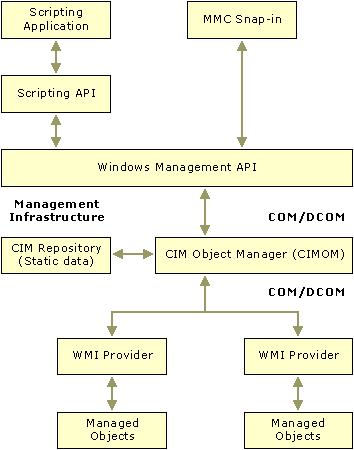

# MMC 2.0 and WMI

Windows Management Instrumentation (WMI) is the Microsoft implementation of Web-Based Enterprise Management (WBEM), an industry initiative to develop a standard technology for accessing management information in an enterprise environment. WMI uses the industry-standard Common Information Model (CIM) to represent systems, applications, networks, devices, and other managed objects in an enterprise environment.

The architecture of the WMI technology consists of the following components:

-   Management infrastructure — the WMI Service coordinates requests for management data between client applications and the sources of the data. The CIM Repository typically holds static management data that does not regularly change, such as class definitions. Dynamic management data is retrieved on-demand from the data source through a provider.
-   Managed objects — any part of the enterprise network from a small piece of hardware such as a disk drive to a large software application such as a database system. These managed objects are modeled using the Common Information Model (CIM).
-   Providers — components that supply dynamic management data about managed objects, handle object-specific requests, or generate WMI events. Providers communicate with the WMI Service using a COM-based API and are normally written using the C or C++ programming language.
-   Management applications — client applications that use WMI information to monitor, configure and control managed objects, measure performance, or perform a variety of other administrative tasks. These applications include stand-alone applications, ActiveX controls, scripts, and MMC snap-ins.

    Applications can be written in any programming language that can communicate with the WMI Service using one of the following WMI-supported APIs:

    -   COM-based API for C/C++
    -   Scripting API for Visual Basic, DHTML, ASP, WSH, and so on.

Third-party developers can place information, including static data, in the CIM Repository by using the Managed Object Format (MOF) language and its compiler, MOFComp.exe, or one of the standard WMI APIs.

WMI currently ships several dynamic providers for Microsoft operating system components including Win32 objects, SNMP data, registry entries, the WMI Security, Active Directory, Windows Driver Model (WDM), Windows Installer (MSI), Event Log, and performance counters.

MMC snap-ins can be used to display any information that is available through WMI. MMC easily integrates with WMI to display WMI information.

For more information about WMI, see the Windows Management Instrumentation SDK.

The rest of this topic discusses information specific to accessing WMI data from within a snap-in.

## Accessing WMI Data

To access WMI data, snap-ins must first connect to a WMI namespace on a particular host computer. All snap-in communication with the desired namespace is then performed using an [**IWbemServices**](https://msdn.microsoft.com/library/aa392093) object bound to the namespace.

Be aware that a WMI namespace is different from an MMC namespace. A WMI namespace is a logical grouping of WMI classes and instances in the WMI Repository, and controls their scope and visibility. An MMC namespace refers to the hierarchical organization of snap-ins and nodes in an MMC console.

To simplify the connection process, snap-ins can use the [**IWbemLocator**](https://msdn.microsoft.com/library/aa391768) interface. This interface provides only one method, [**ConnectServer**](https://msdn.microsoft.com/library/aa391769), which allows WMI clients (snap-ins) to obtain a COM pointer to an [**IWbemServices**](https://msdn.microsoft.com/library/aa392093) object bound to the desired namespace on the desired target computer.

To use [**IWbemLocator**](https://msdn.microsoft.com/library/aa391768), snap-ins must create an instance of the **IWbemLocator** interface that is in-process. The **IWbemLocator** interface pointer returned by [**CoCreateInstance**](_com_cocreateinstance) gives snap-ins access to the namespace hierarchy managed by the WMI Repository.

## Asynchronous Event Notification and Security Issues

WMI can generate two types of events: temporary and permanent. Criteria for both types of events are described using the WQL query language, which is an SQL subset. The following table summarizes the differences between the two types of WMI events.

| Temporary                                                                                                                              | Permanent                                                                                           |
|----------------------------------------------------------------------------------------------------------------------------------------|-----------------------------------------------------------------------------------------------------|
| Only delivered if the event consumer is running.                                                                                       | Uses COM/DCOM to load the event consumer if it is not already loaded.                               |
| Registered by calling [**IWbemServices::ExecNotificationQueryAsync**](https://msdn.microsoft.com/library/aa392106).                   | Registered by adding various "registration" instances to WMI.                                       |
| Events received by your implementation of [**IWbemObjectSink**](https://msdn.microsoft.com/library/aa391787).                                                  | Events received by your implementation of [**IWbemUnboundObjectSink**](https://msdn.microsoft.com/library/aa392125). |
| Event delivery canceled by calling [**IWbemServices::CancelAsyncCall**](https://msdn.microsoft.com/library/aa392094) or exiting the application. | Event delivery canceled by deleting the above "registration" instances.                             |

 

To register an event, call [**IWbemServices::ExecNotificationQueryAsync**](https://msdn.microsoft.com/library/aa392106). This method describes the desired events using the WQL query language and includes a pointer to the [**IWbemObjectSink**](https://msdn.microsoft.com/library/aa391787) object that will receive the event notifications. When an action satisfies the criteria of the WQL query, WMI sends an event notification to the snap-in by calling the **IWbemObjectSink** object's [**Indicate**](https://msdn.microsoft.com/library/aa391788) method.

Because snap-ins run in MMC's process space as in-process server DLLs, they do not own the process token associated with MMC's process space and should not make changes to it. Because of this, DCOM security rules make it difficult for snap-ins to accept event notifications from WMI.

To circumvent this problem, snap-ins must inform DCOM that they will accept events from an unauthenticated user (of MMC's process space). This is done by using the [**IUnsecuredApartment**](https://msdn.microsoft.com/library/aa391415) interface. This interface creates a dedicated process for hosting the snap-in's [**IWbemObjectSink**](https://msdn.microsoft.com/library/aa391787) implementation. The **IUnsecuredApartment** interface contains a method, [**CreateObjectStub**](https://msdn.microsoft.com/library/aa391416), which can be used to create an "event forwarder" to assist in receiving method calls from WMI. This function binds an unsecured object sink to a local object sink so that DCOM security will not prevent asynchronous calls from WMI resulting from an asynchronous method call such as [**IWbemServices::ExecNotificationQueryAsync**](https://msdn.microsoft.com/library/aa392106). The unsecured object sink is then used in the asynchronous methods of the [**IWbemServices**](https://msdn.microsoft.com/library/aa392093) interface.

## Threading Issues and Accessing WMI Data

To prevent their user interface from being blocked, snap-ins might choose to create a background thread for connecting to WMI. Be aware that snap-ins that obtain [**IWbemServices**](https://msdn.microsoft.com/library/aa392093) or [**IEnumWbemClassObject**](https://msdn.microsoft.com/library/aa390857) pointers in a background thread must marshal it into their main thread or any other dialog thread.

## Related topics

<dl> <dt>

[MMC and WMI: Implementation Details](mmc-and-wmi-implementation-details.md)
</dt> </dl>

 

 

