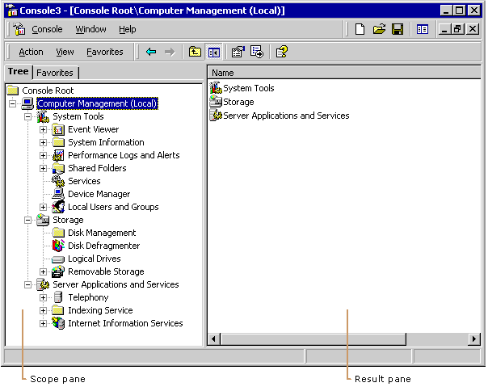

# Namespaces

Below the standard toolbars in the MMC console are two panes, as shown in the following figure. The pane on the left contains the console tree and the pane on the right contains details about the selected node in the console tree. Together, these panes form the *namespace*.

In this documentation, the left pane is called the *scope pane* and the right pane is called the *result pane* to be consistent with the programming documentation.

> [!Note]  
> MMC Help refers to these two panes as the console tree and the details pane, respectively. These are the end-user terms for the panes.

 

The console tree in the scope pane contains the snap-ins that make up the management tool. For the currently selected node in the console tree, the result pane contains the child nodes, information about the node, or a user interface to perform a task on the node.

For more information about the MMC namespace, see [Snap-in Namespace](snap-in-namespace.md) and [MMC Programmer's Guide Overview](mmc-programmer-s-guide-overview.md).

 

 

