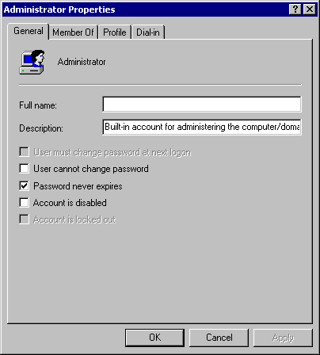

# Property Sheets

In an MMC console, a property sheet is often used to set or view properties of a node, as shown in the following figure. Be aware that a property sheet always includes the **OK**, **Cancel**, and **Apply** buttons by default.

For more information about snap-in property sheets and property pages, see [Adding Property Pages and Wizard Pages](adding-property-pages-and-wizard-pages.md).

 

 

