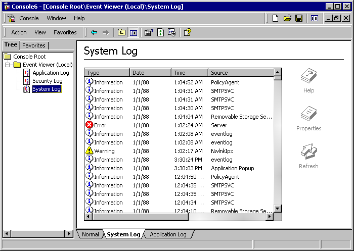

# Taskpads

Because of the object-oriented nature of the console tree, users tend to search for the object they want to manage rather than for a particular task to accomplish. New users may find it easier to follow a task-based approach. At other times, you may want to combine pieces from several different snap-ins to accomplish a task. In either case, you can create an MMC taskpad to fill your need.

The figure above shows the System Log console taskpad. Be aware that if you create multiple taskpads for a single node, each taskpad has its own tab at the bottom of the result pane, as shown.

For more information about MMC taskpads, see [Using Different Result Pane View Types](using-different-result-pane-view-types.md).

 

 

