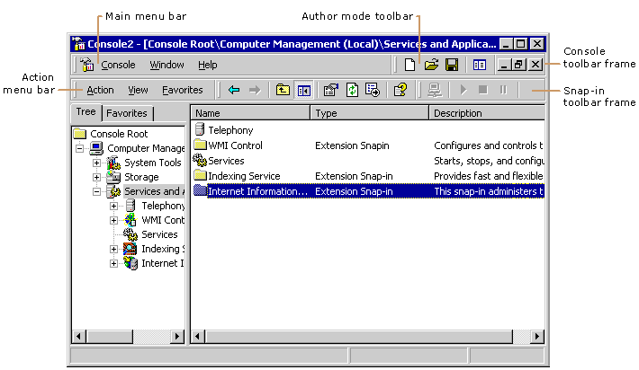

# Toolbars

The MMC console contains two standard Windows toolbar frames, the *console* toolbar frame and the *snap-in* toolbar frame, as shown in the following figure.

Although you cannot make changes to the main menu or the author mode toolbar in the console toolbar frame, you can add drop-down menus and command buttons to the snap-in **Action** menu bar and snap-in toolbars in the toolbar frame. For each node, you can create one or more sets of command buttons (toolbars).

For more information about MMC toolbars, see [Working with Toolbars and Menu Buttons](working-with-toolbars-and-menu-buttons.md).

 

 

