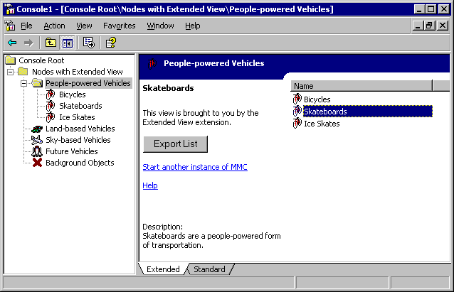

# Using the Extended View Extension - Implementation Details

A primary snap-in using the Extended View extension must register that extension for each extended node type. Additionally, to use the HTML details area of the Extended View, the primary snap-in must support the [**CCF\_HTML\_DETAILS**](ccf-html-details.md) property. Finally, to use the description area of the Extended View, the primary snap-in must support the [**CCF\_DESCRIPTION**](ccf-description.md) property.

The following figure shows an example of the Extended View extension used by a snap-in.

In the preceding figure, the Extended View provides a title bar, which contains the icon and name of the selected scope node. Below the title bar, the right portion of the result pane contains the primary snap-in's list view (or OCX view or HTML view, depending on the scope node's result pane view style). The left portion of the result pane contains the name of the selected list item. These features are provided by registering the Extended View extension for the node type of the selected list item.

The figure depicts an HTML details area and description area as well. To use the HTML details area and description area, the snap-in supports the [**CCF\_HTML\_DETAILS**](ccf-html-details.md) and [**CCF\_DESCRIPTION**](ccf-description.md) properties, respectively. A snap-in can support the **CCF\_HTML\_DETAILS** and **CCF\_DESCRIPTION** properties by either implementing the [**INodeProperties**](/windows/win32/Mmc/nn-mmc-inodeproperties?branch=master) interface where values returned for the **CCF\_HTML\_DETAILS** and **CCF\_DESCRIPTION** properties are text strings, or by providing a clipboard format for the property by name (such as "CCF\_HTML\_DETAILS"). The example depicted above implements the **INodeProperties** interface. The appearance of the HTML details area (consisting of the user interface objects and the code associated with them) is controlled by the **CCF\_HTML\_DETAILS** property, whereas the description below the HTML details area is provided by the **CCF\_DESCRIPTION** property.

## Registering the Extended View extension

The node type that will use the Extended View extension must be registered as one of the node types for the primary snap-in, and the node type must contain an entry for the Extended View's **CLSID**.

## Related topics

<dl> <dt>

[Using the Extended View Extension](using-the-extended-view-extension.md)
</dt> <dt>

[Extending Views](extending-views.md)
</dt> <dt>

[**INodeProperties**](/windows/win32/Mmc/nn-mmc-inodeproperties?branch=master)
</dt> <dt>

[**INodeProperties::GetProperty**](/windows/win32/Mmc/nf-mmc-inodeproperties-getproperty?branch=master)
</dt> </dl>

 

 

